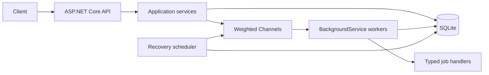

# TaskForge

> A resilient background job processing system built with C#, ASP.NET Core, SQLite, and System.Threading.Channels.

TaskForge is a backend-only reference implementation for durable background work. Jobs enter through a REST API, are persisted before enqueueing, processed by configurable workers, retried with exponential backoff, and dead-lettered after their retry budget is exhausted. It requires no Docker, message broker, external database, or desktop tooling.

## Features

- Durable SQLite job, attempt, and worker state
- Bounded, weighted priority channels (Critical, High, Normal, Low)
- Explicit job state transitions and optimistic concurrency
- Worker ownership leases and abandoned-job recovery
- Per-attempt timeouts, cancellation propagation, and graceful shutdown
- Exponential retry delay (`5 × 3^(n-1)` seconds) with jitter
- Payload-specific validation and five meaningful handlers
- Pagination, filtering, structured API errors, Swagger, health, and metrics
- Unit and integration test projects

## Architecture



SQLite is authoritative; channel messages are wake-up signals. On startup and periodically, recovery finds queued jobs, due retries, and processing jobs with expired leases. A conditional, concurrency-protected acquisition ensures only one worker normally owns a job.

### Projects

- `TaskForge.Domain`: entities, enums, transitions, and domain exceptions
- `TaskForge.Contracts`: immutable public HTTP contracts
- `TaskForge.Application`: use cases and meaningful system boundaries
- `TaskForge.Infrastructure`: EF Core mappings, migration, storage, and metrics
- `TaskForge.Worker`: channels, handlers, workers, retries, and recovery
- `TaskForge.Api`: controllers, middleware, configuration, Swagger, and hosting
- `TaskForge.UnitTests` / `TaskForge.IntegrationTests`: behavioral verification

## Requirements

- .NET 8 SDK or newer SDK capable of targeting .NET 8
- VS Code is optional; every operation uses the .NET CLI

## Run

```bash
dotnet restore TaskForge.sln
dotnet build TaskForge.sln
dotnet run --project src/TaskForge.Api
```

Open `/swagger` on the URL printed by ASP.NET Core. The SQLite file is created at `data/taskforge.db` relative to the API working directory.

## Database migrations

The API applies pending migrations at startup. To manage migrations explicitly, install the matching CLI tool and run:

```bash
dotnet tool install --global dotnet-ef --version 8.*
dotnet ef database update --project src/TaskForge.Infrastructure --startup-project src/TaskForge.Api
dotnet ef migrations add MigrationName --project src/TaskForge.Infrastructure --startup-project src/TaskForge.Api
```

## API examples

Submit a report:

```bash
curl -X POST http://localhost:5000/api/jobs \
  -H "Content-Type: application/json" \
  -d '{
    "type": "generate-report",
    "priority": "High",
    "payload": {
      "reportName": "Monthly Player Statistics",
      "requestedBy": "admin"
    },
    "maxRetries": 3,
    "timeoutSeconds": 30
  }'
```

```bash
curl http://localhost:5000/api/jobs/00000000-0000-0000-0000-000000000000
curl "http://localhost:5000/api/jobs?status=Completed&priority=High&page=1&pageSize=20"
curl -X POST http://localhost:5000/api/jobs/00000000-0000-0000-0000-000000000000/cancel
curl -X POST http://localhost:5000/api/jobs/00000000-0000-0000-0000-000000000000/retry
curl http://localhost:5000/api/jobs/00000000-0000-0000-0000-000000000000/attempts
curl http://localhost:5000/api/workers
curl http://localhost:5000/api/health
curl http://localhost:5000/api/metrics
```

Supported job types and payloads:

| Type | Required payload |
|---|---|
| `generate-report` | `reportName`, `requestedBy` |
| `import-users` | `users` array containing email properties |
| `calculate-game-statistics` | numeric `scores` array |
| `clean-expired-sessions` | object; optional `batches` |
| `send-notification` | `recipient`, `message` |

## Lifecycle and retries

The normal lifecycle is `Pending → Queued → Processing → Completed`. A failed attempt becomes `Retrying`, receives a durable `NextRetryAtUtc`, then returns to `Queued` when due. Once `RetryCount` exceeds `MaxRetries`, it becomes `DeadLettered`. Every execution creates a `JobAttempt` with worker, timestamps, duration, outcome, and sanitized failure details.

Priority selection uses a repeating weighted schedule: four Critical opportunities, three High, two Normal, and one Low. Empty queues are skipped, so capacity is not wasted and low priority cannot starve indefinitely.

## Configuration

`src/TaskForge.Api/appsettings.json` contains strongly typed `TaskForge` settings for worker count, queue capacity, retry defaults, timeouts, heartbeat timing, leases, recovery, and handler output. Invalid bounds fail startup immediately.

## Testing

```bash
dotnet test TaskForge.sln --configuration Release
```

The unit suite exercises lifecycle rules, cancellation, dead-lettering, retry growth, handler resolution, and validation. Integration tests boot the real ASP.NET Core host against SQLite and verify API errors and health.

## Example logs

```text
info: TaskForge.Worker.JobWorkerService[0]
      Job 8b70... (generate-report) acquired by worker-01 for attempt 1
info: TaskForge.Worker.JobWorkerService[0]
      Job 8b70... completed by worker-01 in 42ms
warn: TaskForge.Worker.JobWorkerService[0]
      Job b234... failed on attempt 2; status Retrying, next retry 2026-07-20T15:30:00Z
```

## Future improvements

- Provider-specific distributed acquisition for multi-host deployments
- Idempotency keys and deduplicated submissions
- Pluggable authentication and authorization
- OpenTelemetry export while retaining the dependency-free metrics endpoint
- Job retention and archival policies
