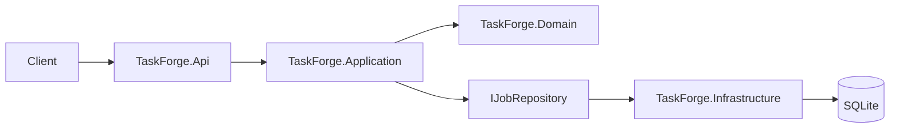

# TaskForge

TaskForge is a backend-only background job processing project built with C#,
ASP.NET Core, SQLite, and .NET 8.

## Implemented

- Job, job-attempt, and worker domain models
- Application-layer `JobManager`
- Job submission validation
- SQLite persistence with EF Core
- Durable job submission, listing, and lookup
- Health endpoint
- Unit and SQLite persistence tests

## Architecture



### Projects

- `TaskForge.Domain`: job and worker state and lifecycle rules
- `TaskForge.Application`: job workflows, validation, and abstractions
- `TaskForge.Infrastructure`: EF Core mappings and SQLite persistence
- `TaskForge.Api`: HTTP endpoints, contracts, configuration, and hosting
- `TaskForge.UnitTests`: domain, application, and persistence tests

## Requirements

- .NET 8 SDK or a newer SDK capable of targeting .NET 8

## Run

```bash
dotnet restore TaskForge.sln
dotnet build TaskForge.sln
dotnet run --project src/TaskForge.Api
```

The default launch profile listens on `http://localhost:5000`. The database is
created at `src/TaskForge.Api/data/taskforge.db`.

## API

```text
GET  /api/health
POST /api/jobs
GET  /api/jobs
GET  /api/jobs/{id}
```

Submit a job:

```bash
curl -X POST http://localhost:5000/api/jobs \
  -H "Content-Type: application/json" \
  -d '{
    "type": "generate-report",
    "priority": "High",
    "payload": {
      "reportName": "Monthly Player Statistics"
    },
    "maxRetries": 3,
    "timeoutSeconds": 30
  }'
```

## Configuration

The SQLite connection string is configured in
`src/TaskForge.Api/appsettings.json`. A missing database and schema are created
when the API starts.

## Testing

```bash
dotnet test TaskForge.sln
```

## Next steps

- Database migrations
- Priority queues
- Background workers and job handlers
- Retry, timeout, cancellation, and dead-letter workflows
- Worker leases and abandoned-job recovery
- Filtering and pagination
- Integration tests
- Swagger, metrics, and structured error middleware
