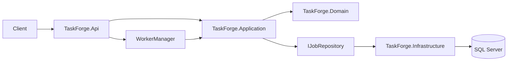

# TaskForge v1.0

TaskForge is a backend-only background job processing project built with C#,
ASP.NET Core, Microsoft SQL Server (MSSQL), and .NET 8.

## Implemented

- Job, job-attempt, and worker domain models
- Application-layer `JobManager`
- Job submission validation
- Job failure, retry, cancellation, and dead-letter rules
- Optimistic-concurrency job acquisition and updates
- Job handler contract
- Allowlisted outbound HTTP request jobs for external integrations
- In-process `WorkerManager` with configurable parallel workers
- Runtime worker scaling persisted in SQL Server
- Priority-first job acquisition, retries, timeouts, cancellation, and lease recovery
- Idempotent submission through the `Idempotency-Key` header
- OpenAPI JSON documentation
- SQL Server persistence with EF Core and startup migrations
- Docker Compose development environment for the API and SQL Server 2022
- Durable job submission, listing, and lookup
- Health endpoint
- Statistics endpoint for current job status counts and success rate
- Docker-independent unit tests and SQL Server integration tests

## Architecture



### Projects

- `TaskForge.Domain`: job and worker state and lifecycle rules
- `TaskForge.Application`: job workflows, validation, worker management, and abstractions
- `TaskForge.Infrastructure`: EF Core mappings, SQL Server persistence, and migrations
- `TaskForge.Api`: HTTP endpoints, configuration, and hosting for the API and workers
- `TaskForge.Debugging`: initial debug-only console harness configured by `debugsettings.json`
- `TaskForge.UnitTests`: Docker-independent domain, application, handler, and debugging tests
- `TaskForge.IntegrationTests`: SQL Server persistence and worker tests using Testcontainers

## Requirements

- Docker with Compose v2; on Windows, run Docker Desktop in Linux container mode
- .NET 8 SDK or a newer SDK capable of targeting .NET 8 for local builds, tests,
  and the debugging dashboard; the Compose API build uses the SDK image

## Run with Docker Compose

Run these commands from the repository root. On first setup, copy the example
environment file. Keep an existing `.env` instead of overwriting it:

```powershell
Copy-Item .env.example .env
```

Edit `.env` and replace `ReplaceWithAStrongPassword123!` with a strong, unique
SQL Server SA password. `.env.example` contains only a placeholder and is
committed; the real password belongs only in `.env`, which Git and the Docker
build context exclude.

Validate the configuration without printing the interpolated password, then
build and start the stack:

```powershell
docker compose config --quiet
docker compose up --build
```

For background operation, use `docker compose up --build -d`. Check the services
and API from another terminal:

```powershell
docker compose ps
Invoke-RestMethod http://localhost:8275/api/health
```

Compose builds the API from `Dockerfile` and starts SQL Server 2022 Developer.
The API starts after SQL Server passes its health check, then applies EF Core
migrations to the `TaskForge` database before serving requests.

The API is available at `http://localhost:8275`; Compose maps host port `8275`
to container port `8080`. SQL Server is reachable by the API at
`sqlserver:1433` on the Compose network and has no published host port.
Database files live in the `sqlserver-data` named volume mounted at
`/var/opt/mssql`, normally named `taskforge_sqlserver-data` by Compose.

Port `8275` is memorable because `TASK` maps to `8275` on a telephone keypad.

### Stop, restart, and reset

Restart only the API, or stop and remove the stack while keeping database data:

```powershell
docker compose restart api
docker compose down
```

Starting again with `docker compose up --build -d` reuses the named volume.
Stored jobs and the selected worker count survive container restarts and
recreation.

**The following reset command deletes the named volume and all SQL Server data,
including jobs and worker settings. Use it only when you intend to discard the
database.** Docker documents volume removal under
[`docker compose down --volumes`](https://docs.docker.com/reference/cli/docker/compose/down/).

```powershell
docker compose down --volumes
```

## API

```text
GET  /api/health
GET  /api/stats
GET  /openapi/v1.json
POST /api/jobs
GET  /api/jobs
GET  /api/jobs/{id}
POST /api/jobs/{id}/cancel
GET  /api/workers
PUT  /api/workers/count
```

### Job statistics

`GET /api/stats` returns `200 OK` with statistics for every job record currently
stored in the database, with no filters, date range, or pagination. Counts reflect
each record's current status, not historical status transitions or execution
attempts. Each job contributes to exactly one status count.

Workers may change job statuses between consecutive requests, so responses may
differ. Each response derives `totalJobs` from its own returned status counts.
The result does not promise a historical or transactionally consistent
point-in-time snapshot. The query uses the database's configured isolation
behavior without `NOLOCK` or a custom isolation-level override.

```json
{
  "totalJobs": 100,
  "countsByStatus": {
    "pending": 0,
    "queued": 12,
    "processing": 3,
    "retrying": 5,
    "completed": 70,
    "deadLettered": 8,
    "cancelled": 2
  },
  "successRatePercent": 89.74
}
```

All counters use C# `long` (64-bit integers). All seven status fields are always
present, including statuses with zero records. `totalJobs` is their sum.
`successRatePercent` is `completed / (completed + deadLettered) * 100`, rounded
to two decimal places with midpoint ties away from zero. Cancelled and unfinished
jobs do not enter this ratio. When the denominator is zero, the rate is `null`.
An empty database returns `200 OK`, `totalJobs: 0`, all seven status counts set
to `0`, and `successRatePercent: null`.

`retrying` counts jobs currently waiting for a retry, not the number of retry
attempts or the sum of their `RetryCount` values. A job waiting after several
failed attempts still contributes exactly one to `retrying`.

A processing job with `CancellationRequested: true` remains in `processing`
until its persisted status changes to `Cancelled`. Only then does it contribute
to `cancelled`. The response uses the seven domain statuses; there is no separate
`Failed` status. Pending, queued, processing, retrying, and cancelled jobs are
excluded from the success-rate denominator.

The aggregate reads only `Status` and `COUNT_BIG(*)` in one `GROUP BY` query.
The existing `(Status, Priority, CreatedAtUtc)` index covers this query, with
`Status` as its leading key. Since all jobs are counted, an index scan is expected.
No `NOLOCK`, additional index, cache, or summary table is used. Any future index
change must be justified by measurements and delivered in a separate migration.

A local SQL Server 2022 Testcontainers check on 2026-09-14 measured **313.65 ms**
for one reader invocation over **100,000 jobs**, with one SQL command and correct
counts. The synthetic data included all seven statuses, four priorities, two job
types, varied creation dates, and approximately 1 KB of Unicode JSON per row.
The estimated plan selected `IX_Jobs_Status_Priority_CreatedAtUtc` with an
`Index Scan` and `Stream Aggregate`. This supports keeping the existing index
for this workload. The elapsed time includes EF query processing and result
materialization, excludes seeding and connection opening, and was measured
without running workers; it is not a production latency guarantee or a
concurrent-load benchmark.

This was a one-time diagnostic; the large-data performance test is not retained
in the normal test suite.

### Submit a job

```bash
curl -X POST http://localhost:8275/api/jobs \
  -H "Content-Type: application/json" \
  -H "Idempotency-Key: health-check-example-001" \
  -d '{
    "type": "http-request",
    "priority": "High",
    "payload": {
      "url": "http://localhost:8080/api/health",
      "method": "GET"
    },
    "maxRetries": 3,
    "timeoutSeconds": 30
  }'
```

The submit request goes to host port `8275`, while the job runs inside the API
container and calls its own port `8080`. In a job URL, `localhost` refers to the
container running the worker.

Reusing the same idempotency key with the same submission returns the original
job. Reusing it with different job properties returns `409 Conflict`.

List jobs with optional filters and bounded, one-based pagination:

```bash
curl "http://localhost:8275/api/jobs?status=Queued&type=http-request&page=1&pageSize=25"
```

The response includes `items`, `page`, `pageSize`, `totalCount`, and
`totalPages`. `priority` is also available as a filter. Page size defaults to
`50` and must be between `1` and `100`.

Cancel a queued or running job:

```bash
curl -X POST http://localhost:8275/api/jobs/JOB_ID/cancel
```

### HTTP request jobs

An external project can submit an `http-request` job and let TaskForge perform
the call asynchronously. For the following Docker Desktop example, start your
callback service on host port `6000`. Add this entry to the existing
`api.environment` mapping in `compose.yaml`, then run `docker compose up --build -d`:

```yaml
HttpRequestJobs__AllowedHosts__2: host.docker.internal
```

Docker Desktop provides
[`host.docker.internal`](https://docs.docker.com/desktop/features/networking/networking-how-tos/)
for container access to services running on the host. The host must also be in
TaskForge's allowlist before submitting the job:

```bash
curl -X POST http://localhost:8275/api/jobs \
  -H "Content-Type: application/json" \
  -H "Idempotency-Key: notify-order-123" \
  -d '{
    "type": "http-request",
    "priority": "Normal",
    "payload": {
      "url": "http://host.docker.internal:6000/hooks/orders",
      "method": "POST",
      "body": {
        "orderId": 123,
        "status": "Ready"
      },
      "headers": {
        "X-TaskForge-Source": "orders"
      }
    },
    "maxRetries": 3,
    "timeoutSeconds": 30
  }'
```

Supported methods are `GET`, `POST`, `PUT`, `PATCH`, and `DELETE`. A `2xx`
response completes the job and stores a compact result containing the HTTP
status code. Request timeouts, `408`, `429`, and `5xx` responses are retried;
other non-success responses are treated as permanent failures.
Unsupported job types and invalid HTTP request payloads return `400 Bad Request`
and are not stored.

Change the number of active workers:

```bash
curl -X PUT http://localhost:8275/api/workers/count \
  -H "Content-Type: application/json" \
  -d '{ "count": 4 }'
```

Worker count can be set from `0` to `8`; zero pauses processing, and the selected
count is restored from SQL Server after an application restart.

## Configuration

Compose reads `MSSQL_SA_PASSWORD` from `.env` and supplies the API connection
string through `ConnectionStrings__TaskForge`. The database name is `TaskForge`
and the server is `sqlserver,1433`. The API requires an explicit connection
string and fails at startup if it is missing or blank.

Schema changes are applied with `MigrateAsync()` during API startup. Migration
files are in `src/TaskForge.Infrastructure/Persistence/Migrations`.

Worker and HTTP handler defaults are configured in
`src/TaskForge.Api/appsettings.json` and can be overridden through the API
service's environment variables in `compose.yaml`:

```json
{
  "Worker": {
    "Count": 1,
    "PollIntervalMilliseconds": 500,
    "RetryDelaySeconds": 5,
    "MaxRetryDelaySeconds": 300,
    "LeaseGraceSeconds": 30
  },
  "HttpRequestJobs": {
    "AllowedHosts": [
      "localhost",
      "127.0.0.1",
      "api.example.com"
    ]
  }
}
```

The configured count is used until a user changes it through the API; API
changes are persisted in SQL Server and take precedence on later starts.
Retry delays grow exponentially from `RetryDelaySeconds` and stop growing at
`MaxRetryDelaySeconds`.

`http-request` jobs are sent only to exact host names in `AllowedHosts`.
Redirects are not followed, which prevents a permitted URL from redirecting a
worker to a host outside the allowlist. Job payloads and headers are returned by
the job API, so do not place secrets in them.

The generated OpenAPI document is always available at
`http://localhost:8275/openapi/v1.json`.

## External project usage

TaskForge v1.0 is intended for server-to-server use on a trusted local or
private network. An external project submits a supported job, saves the returned
job ID, and polls `GET /api/jobs/{id}` until the status is `Completed`,
`Cancelled`, or `DeadLettered`.

TaskForge does not accept executable code from clients; it runs only handlers
registered by the service. The current service includes `http-request`.
Authentication, distributed queues, and plugins are intentionally
outside this release.

## Testing

Run unit tests without Docker:

```bash
dotnet test tests/TaskForge.UnitTests --configuration Release
```

Run persistence and worker database tests with Docker running in Linux container mode:

```bash
dotnet test tests/TaskForge.IntegrationTests --configuration Release
```

The integration project uses [Testcontainers.MsSql](https://dotnet.testcontainers.org/modules/mssql/)
and an [xUnit collection fixture](https://xunit.net/docs/shared-context#collection-fixture)
to share one SQL Server 2022 container across all tests. Each test gets a unique
database, applies the application's EF Core migrations with `MigrateAsync()`,
and deletes its database afterward. Testcontainers removes the container at the
end of the run. Tests do not use the Compose database or require a local `.env`.

Coverage includes competing worker acquisition, optimistic concurrency,
idempotency constraints and concurrent submissions, retry ordering, lease
recovery, worker-count persistence, and cancellation racing with completion.
Save interceptors coordinate competing writes so the concurrency tests exercise
stale versions instead of depending on timing delays.

Run both projects together with Docker available:

```bash
dotnet test TaskForge.sln --configuration Release
```

## Debugging dashboard

Run the API, then start the debugging project in another terminal:

```bash
dotnet run --project src/TaskForge.Debugging
```

The default dashboard shows API health, current worker state, and the five most
recent jobs. The `jobs` command lists up to 20 jobs and supports combinable
status, type, and priority filters:

```bash
dotnet run --project src/TaskForge.Debugging -- jobs --status Retrying
dotnet run --project src/TaskForge.Debugging -- jobs --type http-request --priority High
dotnet run --project src/TaskForge.Debugging -- --help
```

## Worker behavior

`WorkerManager` runs inside the API process and starts the requested number of
worker loops. Each worker processes one job at a time using its own dependency
injection scope. Workers select jobs by priority and age, acquire them using the
job version, execute the matching handler, enforce timeouts, retry transient
failures with capped exponential backoff, dead-letter permanent failures, and
recover expired leases.

Scaling down is graceful: a busy worker finishes its current job before it
stops. Stopping the API also stops all workers; durable queued jobs resume when
the API starts again.

Multi-host execution, distributed queues, and dynamic plugins are outside the
current scope.

## Next steps

- Attempt recording
- Authentication for untrusted networks
- Metrics and structured error middleware
