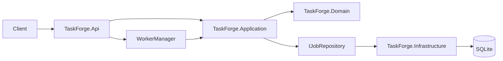

# TaskForge v1.0

TaskForge is a backend-only background job processing project built with C#,
ASP.NET Core, SQLite, and .NET 8.

## Implemented

- Job, job-attempt, and worker domain models
- Application-layer `JobManager`
- Job submission validation
- Job failure, retry, cancellation, and dead-letter rules
- Optimistic-concurrency job acquisition and updates
- Job handler contract
- Allowlisted outbound HTTP request jobs for external integrations
- In-process `WorkerManager` with configurable parallel workers
- Runtime worker scaling persisted in SQLite
- Priority-first job acquisition, retries, timeouts, cancellation, and lease recovery
- Idempotent submission through the `Idempotency-Key` header
- OpenAPI JSON documentation
- SQLite persistence with EF Core
- Durable job submission, listing, and lookup
- Health endpoint
- Unit and SQLite persistence tests

## Architecture



### Projects

- `TaskForge.Domain`: job and worker state and lifecycle rules
- `TaskForge.Application`: job workflows, validation, worker management, and abstractions
- `TaskForge.Infrastructure`: EF Core mappings and SQLite persistence
- `TaskForge.Api`: HTTP endpoints, configuration, and hosting for the API and workers
- `TaskForge.Debugging`: initial debug-only console harness configured by `debugsettings.json`
- `TaskForge.UnitTests`: domain, application, and persistence tests

## Requirements

- .NET 8 SDK or a newer SDK capable of targeting .NET 8

## Run

```bash
dotnet restore TaskForge.sln
dotnet build TaskForge.sln
dotnet run --project src/TaskForge.Api
```

TaskForge listens on `http://localhost:8275` by default. The database is
created at `src/TaskForge.Api/data/taskforge.db`.

Port `8275` is memorable because `TASK` maps to `8275` on a telephone keypad.
Deployments can override the address with `ASPNETCORE_URLS` or the `--urls`
command-line option.

## API

```text
GET  /api/health
GET  /openapi/v1.json
POST /api/jobs
GET  /api/jobs
GET  /api/jobs/{id}
POST /api/jobs/{id}/cancel
GET  /api/workers
PUT  /api/workers/count
```

Submit a job:

```bash
curl -X POST http://localhost:8275/api/jobs \
  -H "Content-Type: application/json" \
  -H "Idempotency-Key: health-check-example-001" \
  -d '{
    "type": "http-request",
    "priority": "High",
    "payload": {
      "url": "http://localhost:8275/api/health",
      "method": "GET"
    },
    "maxRetries": 3,
    "timeoutSeconds": 30
  }'
```

Reusing the same idempotency key with the same submission returns the original
job. Reusing it with different job properties returns `409 Conflict`.

List jobs with optional filters and bounded, one-based pagination:

```bash
curl "http://localhost:8275/api/jobs?status=Queued&type=http-request&page=1&pageSize=25"
```

The response includes `items`, `page`, `pageSize`, `totalCount`, and
`totalPages`. `priority` is also available as a filter. Page size defaults to
`50` and must be between `1` and `100`.

Cancel a queued or running job:

```bash
curl -X POST http://localhost:8275/api/jobs/JOB_ID/cancel
```

### HTTP request jobs

An external project can submit an `http-request` job and let TaskForge perform
the call asynchronously:

```bash
curl -X POST http://localhost:8275/api/jobs \
  -H "Content-Type: application/json" \
  -H "Idempotency-Key: notify-order-123" \
  -d '{
    "type": "http-request",
    "priority": "Normal",
    "payload": {
      "url": "http://localhost:6000/hooks/orders",
      "method": "POST",
      "body": {
        "orderId": 123,
        "status": "Ready"
      },
      "headers": {
        "X-TaskForge-Source": "orders"
      }
    },
    "maxRetries": 3,
    "timeoutSeconds": 30
  }'
```

Supported methods are `GET`, `POST`, `PUT`, `PATCH`, and `DELETE`. A `2xx`
response completes the job and stores a compact result containing the HTTP
status code. Request timeouts, `408`, `429`, and `5xx` responses are retried;
other non-success responses are treated as permanent failures.
Unsupported job types and invalid HTTP request payloads return `400 Bad Request`
and are not stored.

Change the number of active workers:

```bash
curl -X PUT http://localhost:8275/api/workers/count \
  -H "Content-Type: application/json" \
  -d '{ "count": 4 }'
```

Worker count can be set from `0` to `8`; zero pauses processing, and the selected
count is restored from SQLite after an application restart.

## Configuration

The SQLite connection string is configured in
`src/TaskForge.Api/appsettings.json`. A missing database and schema are created
when the API starts.

Worker defaults are configured in the same file:

```json
{
  "Worker": {
    "Count": 1,
    "PollIntervalMilliseconds": 500,
    "RetryDelaySeconds": 5,
    "MaxRetryDelaySeconds": 300,
    "LeaseGraceSeconds": 30
  },
  "HttpRequestJobs": {
    "AllowedHosts": [
      "localhost",
      "127.0.0.1",
      "api.example.com"
    ]
  }
}
```

The configured count is used until a user changes it through the API; API
changes are persisted in SQLite and take precedence on later starts.
Retry delays grow exponentially from `RetryDelaySeconds` and stop growing at
`MaxRetryDelaySeconds`.

`http-request` jobs are sent only to exact host names in `AllowedHosts`.
Redirects are not followed, which prevents a permitted URL from redirecting a
worker to a host outside the allowlist. Job payloads and headers are returned by
the job API, so do not place secrets in them.

The generated OpenAPI document is always available at
`http://localhost:8275/openapi/v1.json`.

## External project usage

TaskForge v1.0 is intended for server-to-server use on a trusted local or
private network. An external project submits a supported job, saves the returned
job ID, and polls `GET /api/jobs/{id}` until the status is `Completed`,
`Cancelled`, or `DeadLettered`.

TaskForge does not accept executable code from clients; it runs only handlers
registered by the service. The current service includes `http-request`.
Authentication, distributed queues, plugins, and containers are intentionally
outside this release.

## Testing

```bash
dotnet test TaskForge.sln
```

## Debugging dashboard

Run the API, then start the debugging project in another terminal:

```bash
dotnet run --project src/TaskForge.Debugging
```

The default dashboard shows API health, current worker state, and the five most
recent jobs. The `jobs` command lists up to 20 jobs and supports combinable
status, type, and priority filters:

```bash
dotnet run --project src/TaskForge.Debugging -- jobs --status Retrying
dotnet run --project src/TaskForge.Debugging -- jobs --type http-request --priority High
dotnet run --project src/TaskForge.Debugging -- --help
```

## Worker behavior

`WorkerManager` runs inside the API process and starts the requested number of
worker loops. Each worker processes one job at a time using its own dependency
injection scope. Workers select jobs by priority and age, acquire them using the
job version, execute the matching handler, enforce timeouts, retry transient
failures with capped exponential backoff, dead-letter permanent failures, and
recover expired leases.

Scaling down is graceful: a busy worker finishes its current job before it
stops. Stopping the API also stops all workers; durable queued jobs resume when
the API starts again.

Multi-host execution, distributed queues, and dynamic plugins are outside the
current scope.

## Next steps

- Database migrations
- Attempt recording
- Integration tests
- Authentication for untrusted networks
- Metrics and structured error middleware
