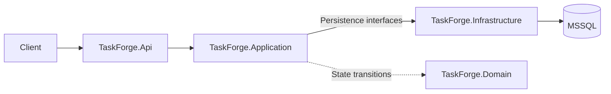
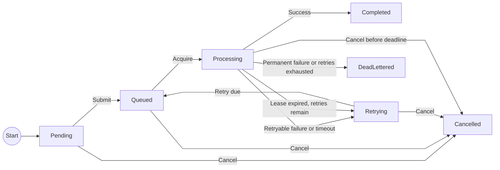

# TaskForge

TaskForge is a .NET 8 background job orchestration server backed by Microsoft SQL
Server (MSSQL). Applications submit work over HTTP; external execution clients
acquire jobs, run their own business code, and report outcomes. TaskForge owns
persistent state, retries, timeouts, cancellation, and execution history.

## Key Features

- Persistent jobs and execution attempts using EF Core and MSSQL.
- Application-scoped, priority-based assignment to compatible external clients.
- Timeouts, capped exponential retries, dead-letter handling, and cancellation.
- Idempotent submission, optimistic concurrency, and expired-lease recovery.
- Filtered and paginated job lists, execution attempt history, and job statistics.
- Docker Compose setup, automated tests, and GitHub Actions CI.

## Quick Start

### Requirements

- Git to clone the repository.
- Docker Desktop with Docker Compose v2, running in Linux container mode.
- PowerShell 5.1 or later.
- Optional: an HTTP client such as Postman, Bruno, or curl for manual API testing.

TaskForge and SQL Server run in containers. You do not need to install .NET or
SQL Server locally.

### Built With

- .NET 8 / ASP.NET Core
- Entity Framework Core 8
- SQL Server 2022
- Docker / Docker Compose
- PowerShell

### Quick Start Flow

```mermaid
flowchart LR
    Clone["Clone repository"] --> Setup["Run ./setup.ps1"]
    Setup --> Docker["Docker starts<br/>TaskForge + SQL Server"]
    Docker --> Ready["GET /api/ready"]
    Ready --> Submit["POST /api/jobs"]
    Submit --> Store["Job stored<br/>in SQL Server"]
    Store --> Worker["External client acquires<br/>and executes job"]
    Worker --> Track["GET /api/jobs/{id}"]
    Track --> Status["Completed / Retrying / DeadLettered"]
```



### 1. Clone the repository

```powershell
git clone https://github.com/Arvence/TaskForge.git
cd TaskForge
```

### 2. Run the setup

```powershell
./setup.ps1
```

Setup checks Docker, creates `.env` from `.env.example` when needed, and securely
prompts for a SQL Server password if one is not configured. It preserves existing
configuration; use the original SA password if a database volume already exists.

Accept `Start TaskForge now? [Y/n]` to build and start the containers. Setup waits
for SQL Server health and API readiness, then prints the local URLs. The API uses
port `8275`. Maintenance starts automatically; business execution requires an
external client.

If Windows blocks the script, run
`powershell -NoProfile -ExecutionPolicy Bypass -File ./setup.ps1`.

### 3. Verify TaskForge

GET [http://localhost:8275/api/ready](http://localhost:8275/api/ready)

```powershell
Invoke-RestMethod http://localhost:8275/api/ready
```

Expect `200 OK` with `{"status":"Ready"}` before submitting jobs.

### 4. Submit a job

`POST http://localhost:8275/api/jobs` with `Content-Type: application/json`:

```powershell
$body = @'
{
  "applicationId": "example-app",
  "type": "http-request",
  "priority": "Normal",
  "payload": {
    "url": "http://localhost:8275/api/health",
    "method": "GET"
  },
  "maxRetries": 3,
  "timeoutSeconds": 30
}
'@

$job = Invoke-RestMethod http://localhost:8275/api/jobs -Method Post -ContentType 'application/json' -Body $body
$job.id
```

TaskForge persists the job in SQL Server and returns `201 Created` with its ID.
The job remains queued until an external client supporting `http-request` requests
it through `POST /api/executions/wait`. The example URL is resolved by that client.
TaskForge does not execute HTTP requests or any other business handler.

### 5. Track the job

`GET http://localhost:8275/api/jobs/{id}`; replace `{id}` with the returned job ID.
In the same PowerShell session:

```powershell
Invoke-RestMethod "http://localhost:8275/api/jobs/$($job.id)" | ConvertTo-Json -Depth 5
```

- Success: `Queued → Processing → Completed`.
- Retry: `Queued → Processing → Retrying → Queued → Processing → Completed`.
- Permanent failures or exhausted retries end in `DeadLettered`.

Without an execution client, the job stays `Queued`. After a client reports
success, it becomes `Completed` and exposes the result supplied by that client.

### 6. Inspect execution history

`GET http://localhost:8275/api/jobs/{id}/attempts`

```powershell
Invoke-RestMethod "http://localhost:8275/api/jobs/$($job.id)/attempts" | ConvertTo-Json -Depth 5
```

This returns execution attempts in order, including retry history, outcomes,
timings, and errors. A job that has not been acquired has no attempts.

### 7. Stop TaskForge

```powershell
docker compose down
```

The SQL Server named volume preserves jobs and execution history.
Do not add `--volumes` unless you intend to delete that data.

## Architecture / Request Flow



- **Api:** HTTP endpoints, dependency registration, and hosting for maintenance.
- **Application:** envelope validation, job workflows, and execution orchestration;
  depends on persistence interfaces rather than EF Core.
- **Domain:** job states, attempt outcomes, and lifecycle rules.
- **Infrastructure:** EF Core persistence and SQL Server migrations. Legacy handler
  source remains for later relocation and is not registered by the server.

A submission is validated, queued, and saved before the API returns its ID.
External clients acquire eligible jobs and report completion or failure through
the server protocol. Maintenance recovers expired executions even when no clients
are connected. Submission validates the envelope and JSON, not business payloads.
Types such as `send-email` require no server-side implementation.

## Job Lifecycle



`Pending` is the initial domain state; accepted submissions are stored as
`Queued`. Retries wait for their backoff before becoming eligible again.
Lease recovery applies the timeout retry budget and backoff to interrupted work,
ending in `DeadLettered` when retries are exhausted. Requested cancellation wins
and becomes `Cancelled` without consuming a retry. Cancelling a running job before
its deadline atomically cancels the job and running attempt and clears ownership.
Cancellation uses persistent server state and does not require a connected client.
It does not confirm that remote code has stopped. If the deadline has passed,
timeout is resolved first: cancellation then cancels the retrying job, or returns
`409` if timeout exhausted its retries. Complete and Fail reject cancelled executions.

## API Endpoints

| Method | Endpoint | Description |
| --- | --- | --- |
| `POST` | `/api/jobs` | Submit a job, optionally with an `Idempotency-Key` header. |
| `GET` | `/api/jobs` | Filter by status, type, or priority; paginate newest-first results. |
| `GET` | `/api/jobs/{id}` | Retrieve a job's state and result. |
| `GET` | `/api/jobs/{id}/attempts` | Retrieve attempts in ascending attempt-number order. |
| `POST` | `/api/jobs/{id}/cancel` | Request cancellation of an unfinished job. |
| `POST` | `/api/jobs/{id}/retry` | Replay a dead-lettered or cancelled job as a new job. |
| `POST` | `/api/executions/wait` | Wait for one committed execution assignment, or return `204`. |
| `POST` | `/api/jobs/{jobId}/attempts/{attemptId}/complete` | Report completion or acknowledge an identical accepted report. |
| `POST` | `/api/jobs/{jobId}/attempts/{attemptId}/fail` | Report failure using server-owned retry policy. |
| `GET` | `/api/workers` | Retired; returns `410 Gone`. |
| `PUT` | `/api/workers/count` | Retired; returns `410 Gone`. |
| `GET` | `/api/stats` | Get current job counts and success rate. |
| `GET` | `/api/health` | Check application liveness without querying the database. |
| `GET` | `/api/ready` | Check database connectivity; returns `200` or `503`. |
| `GET` | `/openapi/v1.json` | Read the generated OpenAPI document. |
| `GET` | `/` | Redirect to `/api/health`. |

Job lists return `items`, `page`, `pageSize`, `totalCount`, and `totalPages`.
Pages start at `1`; page size defaults to `50` and accepts `1`–`100`.
For example: `GET /api/jobs?status=Queued&priority=High&page=1&pageSize=25`.

### Wait for work

`POST /api/executions/wait` is available in normal API startup:

```json
{
  "applicationId": "billing",
  "workerId": "worker-01",
  "supportedTypes": ["generate-report"],
  "waitSeconds": 20
}
```

Application IDs use the existing trim/lowercase normalization. Worker IDs must
be nonblank and at most 200 characters; their exact spelling is preserved.
Provide 1 to 100 supported types, each nonblank and at most 100 characters.
Matching types is case-insensitive. `waitSeconds` accepts integers from 0 to 30,
defaults to 20, and uses 0 for a single immediate acquisition attempt.
Invalid input returns `400` before polling the database.

Success returns `200` with `jobId`, `applicationId`, `attemptId`, `attemptNumber`,
`workerId`, `type`, the JSON `payload`, `timeoutSeconds`, `startedAtUtc`,
`deadlineAtUtc`, and `leaseExpiresAtUtc`. The job and attempt are already committed
when returned. Only compatible jobs from the requested application are eligible;
the existing priority, due-retry, and creation ordering applies. If no assignment
is available before the wait expires, the response is `204` with no body.

Polling occurs every 500 ms, with a fresh database scope per attempt. Connections
and transactions are released before waiting. Request disconnects and host shutdown
cancel pending acquisition and delays. The wait limit also cancels an in-flight
database acquisition; a zero-second wait still allows its one database operation
to finish. A claim committed before a disconnect or lost acknowledgement remains
owned until normal deadline and lease recovery. Neither HTTP delivery nor an
uncertain commit is automatically replayed to claim another job. Clients should
inspect existing job/attempt state after uncertain delivery rather than blindly
retrying the request; a new wait request may claim different work.

Wait, Complete, and Fail are registered in normal startup. The server has no local
executor, worker manager, business handlers, or process-local cancellation signal.
`Worker:Count` and persisted desired worker counts are ignored. The existing
`Worker:PollIntervalMilliseconds`, `RetryDelaySeconds`, `MaxRetryDelaySeconds`, and
`LeaseGraceSeconds` settings continue to control maintenance and retry/lease policy.
The retired worker-management routes return a `410 Gone` problem response during
migration; execution capacity belongs to external clients.

## Request / Response Examples

Use `http://localhost:8275` as the base URL and replace `{id}` with a returned
job ID. Job response bodies below show selected fields; the examples illustrate
different outcomes rather than a single sequence.

### Submit a job

`POST /api/jobs` — `Content-Type: application/json`,
`Idempotency-Key: health-check-001`

Request:

```json
{
  "applicationId": "example-app",
  "type": "http-request",
  "priority": "High",
  "payload": {
    "url": "http://localhost:8275/api/health",
    "method": "GET"
  },
  "maxRetries": 3,
  "timeoutSeconds": 30
}
```

Response: `201 Created`, with a `Location` header pointing to the job.

```json
{
  "id": "a70c8b73-6bb2-4fa4-a2bb-4f5c054c7a72",
  "type": "http-request",
  "status": "Queued"
}
```

An external client must implement `http-request`; the server only stores its JSON.
Replaying the same submission and idempotency key returns
`200` with the original job; changing the submission under that key returns `409`.

### Generate an expense report

`POST /api/jobs` with `Content-Type: application/json`:

```json
{
  "applicationId": "example-app",
  "type": "generate-report",
  "payload": {
    "title": "September expenses",
    "entries": [
      { "category": "Travel", "amount": 125.50 },
      { "category": "Supplies", "amount": 40.25 },
      { "category": "Travel", "amount": 24.50 }
    ]
  },
  "maxRetries": 3,
  "timeoutSeconds": 30
}
```

An external report client can complete the job with this `result`, which is then
returned by `GET /api/jobs/{id}`:

```json
{
  "title": "September expenses",
  "entryCount": 3,
  "totalAmount": 190.25,
  "categories": [
    { "category": "Supplies", "entryCount": 1, "totalAmount": 40.25 },
    { "category": "Travel", "entryCount": 2, "totalAmount": 150.00 }
  ]
}
```

Business payload rules belong to the execution client. TaskForge accepts valid JSON
without resolving a handler; a client can report `InvalidPayload` through the Fail
endpoint to record a permanent failure. Existing handler source is retained for
later relocation and does not run in the API host.

### Retrieve a job

`GET /api/jobs/{id}` — example `200 OK` response after execution:

```json
{
  "id": "a70c8b73-6bb2-4fa4-a2bb-4f5c054c7a72",
  "status": "Completed",
  "retryCount": 0,
  "result": { "statusCode": 200, "reasonPhrase": "OK" }
}
```

### Cancel a job

`POST /api/jobs/{id}/cancel` — no request body.
Example `200 OK` response for a job cancelled while queued:

```json
{
  "id": "a70c8b73-6bb2-4fa4-a2bb-4f5c054c7a72",
  "status": "Cancelled",
  "cancellationRequested": true
}
```

Repeated cancellation of a cancelled job returns `200` without changing it.
An unknown job returns `404`; a completed or dead-lettered job or a conflicting
update returns `409`.

### Replay a job

`POST /api/jobs/{id}/retry` requires no request body. Only `DeadLettered` and
`Cancelled` jobs can be replayed. Success returns `201 Created`, the new job,
and a `Location` header pointing to `/api/jobs/{newId}`.

Replay uses normal submission validation and persistence, preserving the type,
payload, priority, maximum retries, and timeout. The new job is queued immediately
with a new ID and timestamps, zero retries, no cancellation request, and no
execution attempts. The original job and its attempt history remain unchanged.
External clients acquire the new job through the wait endpoint; automatic retries are
unchanged and apply independently to the new job.

The original idempotency key is not copied: the new job's `idempotencyKey` is
`null`. This endpoint ignores the `Idempotency-Key` header. Every successful call,
including repeated or concurrent calls for the same source, creates a separate job.

An unknown job returns `404`. All other states, including `Completed`, return
`409` with a message and the source status. If the saved definition no longer
passes current submission validation, the endpoint returns a `400` validation
problem without creating a job.

### Inspect execution attempts

`GET /api/jobs/{id}/attempts` — example `200 OK` response:

```json
[
  {
    "jobId": "a70c8b73-6bb2-4fa4-a2bb-4f5c054c7a72",
    "attemptId": "c8b59454-9eb3-4720-8fef-f008e7a3d0e6",
    "attemptNumber": 1,
    "workerId": "taskforge-api-1-1",
    "startedAtUtc": "2026-09-17T12:00:00Z",
    "deadlineAtUtc": "2026-09-17T12:00:30Z",
    "finishedAtUtc": "2026-09-17T12:00:00.250Z",
    "durationMilliseconds": 250,
    "outcome": "Succeeded",
    "errorCode": null,
    "errorMessage": null
  }
]
```

Outcomes are `Running`, `Succeeded`, `Failed`, `PermanentlyFailed`, `TimedOut`,
`Cancelled`, or `Abandoned`. Running attempts have no finish time or duration.
A job with no executions returns `[]`; a missing job returns `404`.
`attemptId` is the persisted identity used in Complete/Fail URLs. `deadlineAtUtc`
is derived from that attempt's start plus the job's timeout, including for historical
attempts. Lease grace does not extend the execution deadline. Existing fields and
ascending attempt-number ordering are preserved.

### Report an execution

After acquiring work through `POST /api/executions/wait`, use the returned
`jobId`, `attemptId`, and exact `workerId` to report the client-owned execution:

```http
POST /api/jobs/{jobId}/attempts/{attemptId}/complete
Content-Type: application/json

{"applicationId":"my-app","workerId":"client-1","result":{"ok":true}}
```

An omitted or JSON `null` result is accepted. Other JSON results must fit within
4,000 characters after compact serialization. To report a failure:

```http
POST /api/jobs/{jobId}/attempts/{attemptId}/fail
Content-Type: application/json

{"applicationId":"my-app","workerId":"client-1","errorCode":"Temporary","errorMessage":"The dependency is unavailable."}
```

The server decides retries, backoff, and exhaustion. `InvalidPayload`,
`UnsupportedJobType`, and `NonRetryableJobException` are permanent errors.
Both operations return `200` with the current job for an accepted report or an
identical previously accepted report. Duplicate reports do not rewrite history
or consume another retry; a historical failure duplicate can return a job that
has since moved to a later attempt.

| Response | Contract |
|---|---|
| `400` | `application/problem+json`; validation errors include an `errors` dictionary. Malformed JSON or binding errors use the same media type without field validation details. |
| `404` | Report Problem Details indicate that the application/job/attempt combination was not found. |
| `409` | Report Problem Details identify a stale, conflicting, cancelled, or timed-out execution. A late first report can persist the timeout transition. |
| `415` | Problem Details for a body with an unsupported content type. |
| `500` | Generic Problem Details without internal exception details. |

Existing job lookup/replay/cancellation errors retain their JSON `message`;
terminal-state conflicts also include `status`. Submission idempotency conflicts
retain `message` and `idempotencyKey`. Readiness retains its `status` body with
`200` or `503`. Full response schemas are available at `/openapi/v1.json`.

Submission, acquisition, reporting, job/history reads, cancellation, replay,
listing, statistics, and readiness can all be validated over HTTP without an SDK.

### Get job statistics

`GET /api/stats` — example `200 OK` response:

```json
{
  "totalJobs": 10,
  "countsByStatus": {
    "pending": 0,
    "queued": 1,
    "processing": 1,
    "retrying": 0,
    "completed": 6,
    "deadLettered": 2,
    "cancelled": 0
  },
  "successRatePercent": 75
}
```

Statistics describe current job states, not execution attempts. Success rate is
`completed / (completed + deadLettered) * 100`, rounded to two decimal places;
it is `null` when neither outcome exists.

## Testing & CI

Use the .NET 8 SDK for local development. Unit tests run without Docker;
integration tests use real MSSQL through Testcontainers and require a running
Linux container engine.

```powershell
dotnet test tests/TaskForge.UnitTests --configuration Release
dotnet test TaskForge.sln --configuration Release
dotnet build TaskForge.sln --configuration Release
```

The [GitHub Actions workflow](.github/workflows/ci.yml) runs on pushes and pull
requests to `main`, or manually. Windows checks the Release build and unit
tests; Ubuntu runs MSSQL integration tests and builds the API Docker image.
The workflow does not publish or deploy the image.

## Known Limitations

- Intended for a trusted network; the API has no authentication. Business work
  requires external execution clients; no client SDK is included yet.
- External requests can repeat after retries or lease recovery. Submission
  idempotency does not guarantee exactly-once side effects; receivers must
  tolerate duplicate calls.
- The server accepts arbitrary valid job types; clients must provide their
  implementations. Job payloads and headers are readable through the API and
  should not contain secrets.
- Legacy acquisitions without attempts receive one `LegacyLeaseRecovery` history
  entry using their persisted worker and acquisition time. This does not confirm
  that execution started. Recovery finish times record detection, not the exact
  interruption time. Ambiguous ownership is logged and held for investigation.
