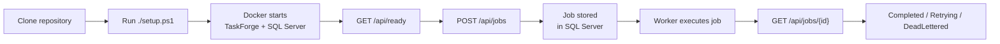
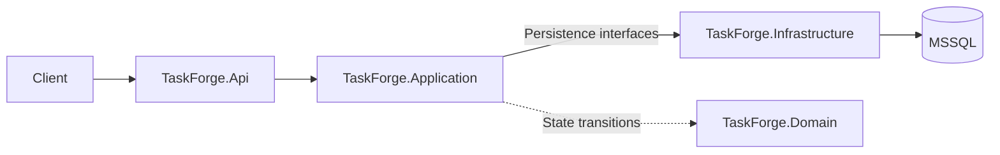
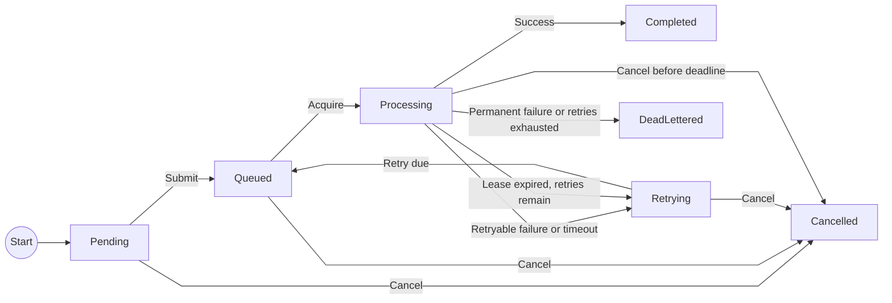

# TaskForge

TaskForge is a .NET 8 background job-processing system backed by Microsoft SQL
Server (MSSQL). It lets applications submit work over HTTP, process it
asynchronously, and inspect progress and execution history. Built-in handlers
send HTTP requests to allowlisted hosts and generate structured expense reports.

## Key Features

- Persistent jobs and worker settings using EF Core and MSSQL.
- Priority-based processing with up to eight workers, adjustable at runtime.
- Timeouts, capped exponential retries, dead-letter handling, and cancellation.
- Idempotent submission, optimistic concurrency, and expired-lease recovery.
- Filtered and paginated job lists, execution attempt history, and job statistics.
- Docker Compose setup, automated tests, and GitHub Actions CI.

## Quick Start

### Requirements

- Git to clone the repository.
- Docker Desktop with Docker Compose v2, running in Linux container mode.
- PowerShell 5.1 or later.
- Optional: an HTTP client such as Postman, Bruno, or curl for manual API testing.

TaskForge and SQL Server run in containers. You do not need to install .NET or
SQL Server locally.

### Built With

- .NET 8 / ASP.NET Core
- Entity Framework Core 8
- SQL Server 2022
- Docker / Docker Compose
- PowerShell

### Quick Start Flow



### 1. Clone the repository

```powershell
git clone https://github.com/Arvence/TaskForge.git
cd TaskForge
```

### 2. Run the setup

```powershell
./setup.ps1
```

Setup checks Docker, creates `.env` from `.env.example` when needed, and securely
prompts for a SQL Server password if one is not configured. It preserves existing
configuration; use the original SA password if a database volume already exists.

Accept `Start TaskForge now? [Y/n]` to build and start the containers. Setup waits
for SQL Server health and API readiness, then prints the local URLs. The API uses
port `8275`; a new database starts with one worker.

If Windows blocks the script, run
`powershell -NoProfile -ExecutionPolicy Bypass -File ./setup.ps1`.

### 3. Verify TaskForge

GET [http://localhost:8275/api/ready](http://localhost:8275/api/ready)

```powershell
Invoke-RestMethod http://localhost:8275/api/ready
```

Expect `200 OK` with `{"status":"Ready"}` before submitting jobs.

### 4. Submit a job

`POST http://localhost:8275/api/jobs` with `Content-Type: application/json`:

```powershell
$body = @'
{
  "type": "http-request",
  "priority": "Normal",
  "payload": {
    "url": "http://localhost:8080/api/health",
    "method": "GET"
  },
  "maxRetries": 3,
  "timeoutSeconds": 30
}
'@

$job = Invoke-RestMethod http://localhost:8275/api/jobs -Method Post -ContentType 'application/json' -Body $body
$job.id
```

TaskForge persists the job in SQL Server and returns `201 Created` with its ID.
A background worker executes it independently. The example calls TaskForge's own
health endpoint on port `8080` inside the API container; your client uses `8275`.

### 5. Track the job

`GET http://localhost:8275/api/jobs/{id}`; replace `{id}` with the returned job ID.
In the same PowerShell session:

```powershell
Invoke-RestMethod "http://localhost:8275/api/jobs/$($job.id)" | ConvertTo-Json -Depth 5
```

- Success: `Queued → Processing → Completed`.
- Retry: `Queued → Processing → Retrying → Queued → Processing → Completed`.
- Permanent failures or exhausted retries end in `DeadLettered`.

Repeat the request until the job finishes. For this example, expect `Completed`
with `result.statusCode` equal to `200`.

### 6. Inspect execution history

`GET http://localhost:8275/api/jobs/{id}/attempts`

```powershell
Invoke-RestMethod "http://localhost:8275/api/jobs/$($job.id)/attempts" | ConvertTo-Json -Depth 5
```

This returns execution attempts in order, including retry history, outcomes,
timings, and errors. The successful example has one `Succeeded` attempt.

### 7. Stop TaskForge

```powershell
docker compose down
```

The SQL Server named volume preserves jobs, execution history, and worker settings.
Do not add `--volumes` unless you intend to delete that data.

## Architecture / Request Flow



- **Api:** HTTP endpoints, dependency registration, and hosting for the workers.
- **Application:** submission validation, job workflows, and worker orchestration;
  depends on persistence interfaces rather than EF Core.
- **Domain:** job states, attempt outcomes, and lifecycle rules.
- **Infrastructure:** EF Core persistence, SQL Server migrations, and job handlers.

A submission is validated, queued, and saved before the API returns its ID.
Workers in the same process acquire eligible jobs from MSSQL, execute the
handler, and persist the result and attempt history.

## Job Lifecycle



`Pending` is the initial domain state; accepted submissions are stored as
`Queued`. Retries wait for their backoff before becoming eligible again.
Lease recovery applies the timeout retry budget and backoff to interrupted work,
ending in `DeadLettered` when retries are exhausted. Requested cancellation wins
and becomes `Cancelled` without consuming a retry. Cancelling a running job before
its deadline atomically cancels the job and running attempt and clears ownership.
Cancellation uses persistent server state and does not require a connected client.
It does not confirm that remote code has stopped. If the deadline has passed,
timeout is resolved first: cancellation then cancels the retrying job, or returns
`409` if timeout exhausted its retries. Complete and Fail reject cancelled executions.

## API Endpoints

| Method | Endpoint | Description |
| --- | --- | --- |
| `POST` | `/api/jobs` | Submit a job, optionally with an `Idempotency-Key` header. |
| `GET` | `/api/jobs` | Filter by status, type, or priority; paginate newest-first results. |
| `GET` | `/api/jobs/{id}` | Retrieve a job's state and result. |
| `GET` | `/api/jobs/{id}/attempts` | Retrieve attempts in ascending attempt-number order. |
| `POST` | `/api/jobs/{id}/cancel` | Request cancellation of an unfinished job. |
| `POST` | `/api/jobs/{id}/retry` | Replay a dead-lettered or cancelled job as a new job. |
| `GET` | `/api/workers` | Inspect workers and the desired worker count. |
| `PUT` | `/api/workers/count` | Set the worker count using `{"count": 4}`; accepts `0`–`8`. |
| `GET` | `/api/stats` | Get current job counts and success rate. |
| `GET` | `/api/health` | Check application liveness without querying the database. |
| `GET` | `/api/ready` | Check database connectivity; returns `200` or `503`. |
| `GET` | `/openapi/v1.json` | Read the generated OpenAPI document. |
| `GET` | `/` | Redirect to `/api/health`. |

Job lists return `items`, `page`, `pageSize`, `totalCount`, and `totalPages`.
Pages start at `1`; page size defaults to `50` and accepts `1`–`100`.
For example: `GET /api/jobs?status=Queued&priority=High&page=1&pageSize=25`.

## Request / Response Examples

Use `http://localhost:8275` as the base URL and replace `{id}` with a returned
job ID. Job response bodies below show selected fields; the examples illustrate
different outcomes rather than a single sequence.

### Submit a job

`POST /api/jobs` — `Content-Type: application/json`,
`Idempotency-Key: health-check-001`

Request:

```json
{
  "type": "http-request",
  "priority": "High",
  "payload": {
    "url": "http://localhost:8080/api/health",
    "method": "GET"
  },
  "maxRetries": 3,
  "timeoutSeconds": 30
}
```

Response: `201 Created`, with a `Location` header pointing to the job.

```json
{
  "id": "a70c8b73-6bb2-4fa4-a2bb-4f5c054c7a72",
  "type": "http-request",
  "status": "Queued"
}
```

The job calls port `8080` inside the API container; the client submits through
host port `8275`. Replaying the same submission and idempotency key returns
`200` with the original job; changing the submission under that key returns `409`.

### Generate an expense report

`POST /api/jobs` with `Content-Type: application/json`:

```json
{
  "type": "generate-report",
  "payload": {
    "title": "September expenses",
    "entries": [
      { "category": "Travel", "amount": 125.50 },
      { "category": "Supplies", "amount": 40.25 },
      { "category": "Travel", "amount": 24.50 }
    ]
  },
  "maxRetries": 3,
  "timeoutSeconds": 30
}
```

After completion, `GET /api/jobs/{id}` includes this `result`:

```json
{
  "title": "September expenses",
  "entryCount": 3,
  "totalAmount": 190.25,
  "categories": [
    { "category": "Supplies", "entryCount": 1, "totalAmount": 40.25 },
    { "category": "Travel", "entryCount": 2, "totalAmount": 150.00 }
  ]
}
```

Provide a nonblank title (at most 120 characters), 1–1000 entries, and a
nonblank category (at most 80 characters) for each entry. Amounts must be JSON
numbers between 0 and 1,000,000,000,000 with at most two decimal places; use one
currency for the entire report. Titles and categories are trimmed. Categories
are grouped case-sensitively and sorted using ordinal order. Decimal totals are
deterministic, with no timestamps, external calls, or generated files.

The report uses the normal worker, result storage, timeout, and cancellation
flow. Invalid payloads return `400` at submission; invalid persisted payloads
fail permanently without retries.

### Retrieve a job

`GET /api/jobs/{id}` — example `200 OK` response after execution:

```json
{
  "id": "a70c8b73-6bb2-4fa4-a2bb-4f5c054c7a72",
  "status": "Completed",
  "retryCount": 0,
  "result": { "statusCode": 200, "reasonPhrase": "OK" }
}
```

### Cancel a job

`POST /api/jobs/{id}/cancel` — no request body.
Example `200 OK` response for a job cancelled while queued:

```json
{
  "id": "a70c8b73-6bb2-4fa4-a2bb-4f5c054c7a72",
  "status": "Cancelled",
  "cancellationRequested": true
}
```

Repeated cancellation of a cancelled job returns `200` without changing it.
An unknown job returns `404`; a completed or dead-lettered job or a conflicting
update returns `409`.

### Replay a job

`POST /api/jobs/{id}/retry` requires no request body. Only `DeadLettered` and
`Cancelled` jobs can be replayed. Success returns `201 Created`, the new job,
and a `Location` header pointing to `/api/jobs/{newId}`.

Replay uses normal submission validation and persistence, preserving the type,
payload, priority, maximum retries, and timeout. The new job is queued immediately
with a new ID and timestamps, zero retries, no cancellation request, and no
execution attempts. The original job and its attempt history remain unchanged.
Workers execute the new job through the normal pipeline; automatic retries are
unchanged and apply independently to the new job.

The original idempotency key is not copied: the new job's `idempotencyKey` is
`null`. This endpoint ignores the `Idempotency-Key` header. Every successful call,
including repeated or concurrent calls for the same source, creates a separate job.

An unknown job returns `404`. All other states, including `Completed`, return
`409` with a message and the source status. If the saved definition no longer
passes current submission validation, the endpoint returns a `400` validation
problem without creating a job.

### Inspect execution attempts

`GET /api/jobs/{id}/attempts` — example `200 OK` response:

```json
[
  {
    "jobId": "a70c8b73-6bb2-4fa4-a2bb-4f5c054c7a72",
    "attemptNumber": 1,
    "workerId": "taskforge-api-1-1",
    "startedAtUtc": "2026-09-17T12:00:00Z",
    "finishedAtUtc": "2026-09-17T12:00:00.250Z",
    "durationMilliseconds": 250,
    "outcome": "Succeeded",
    "errorCode": null,
    "errorMessage": null
  }
]
```

Outcomes are `Running`, `Succeeded`, `Failed`, `PermanentlyFailed`, `TimedOut`,
`Cancelled`, or `Abandoned`. Running attempts have no finish time or duration.
A job with no executions returns `[]`; a missing job returns `404`.

### Get job statistics

`GET /api/stats` — example `200 OK` response:

```json
{
  "totalJobs": 10,
  "countsByStatus": {
    "pending": 0,
    "queued": 1,
    "processing": 1,
    "retrying": 0,
    "completed": 6,
    "deadLettered": 2,
    "cancelled": 0
  },
  "successRatePercent": 75
}
```

Statistics describe current job states, not execution attempts. Success rate is
`completed / (completed + deadLettered) * 100`, rounded to two decimal places;
it is `null` when neither outcome exists.

## Testing & CI

Use the .NET 8 SDK for local development. Unit tests run without Docker;
integration tests use real MSSQL through Testcontainers and require a running
Linux container engine.

```powershell
dotnet test tests/TaskForge.UnitTests --configuration Release
dotnet test TaskForge.sln --configuration Release
dotnet build TaskForge.sln --configuration Release
```

The [GitHub Actions workflow](.github/workflows/ci.yml) runs on pushes and pull
requests to `main`, or manually. Windows checks the Release build and unit
tests; Ubuntu runs MSSQL integration tests and builds the API Docker image.
The workflow does not publish or deploy the image.

## Known Limitations

- Designed for one API instance with in-process workers on a trusted network;
  the API has no authentication.
- External requests can repeat after retries or lease recovery. Submission
  idempotency does not guarantee exactly-once side effects; receivers must
  tolerate duplicate calls.
- Only registered handlers execute; supported job types are `http-request` and
  `generate-report`. Job payloads and headers are readable through the API and should
  not contain secrets.
- Legacy acquisitions without attempts receive one `LegacyLeaseRecovery` history
  entry using their persisted worker and acquisition time. This does not confirm
  that execution started. Recovery finish times record detection, not the exact
  interruption time. Ambiguous ownership is logged and held for investigation.
