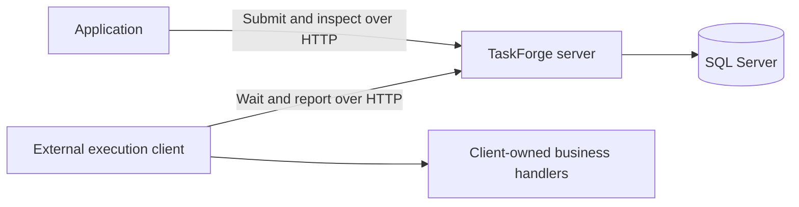

# TaskForge

TaskForge is a .NET 10 job orchestration server backed by SQL Server. It lets an
application submit work and inspect its progress without keeping a request open
while the work runs. External clients execute their own business code; TaskForge
persists the jobs, assigns compatible work, and manages retries, deadlines,
cancellation, and attempt history.

**Release candidate: 2.0.0.** This is a locally runnable portfolio project.
The [changelog](CHANGELOG.md), [draft release notes](docs/release-notes.md), and
[verification report](docs/verification.md) describe the candidate and its limits.

## Features and architecture

- Durable jobs and attempt history in SQL Server through EF Core.
- Application/type routing, priorities, and guarded concurrent acquisition.
- Capped retry backoff, permanent failures, dead-letter handling, and manual replay.
- Fixed execution deadlines, persistent cancellation, and restart recovery.
- Application-scoped submission idempotency and duplicate outcome handling.
- HTTP APIs for submission, execution, inspection, statistics, and readiness.
- Optional independent .NET SDK and a standalone sample execution client.


```mermaid
flowchart LR
    Submitter[Application] -->|Submit and inspect over HTTP| API[TaskForge server]
    Worker[External execution client] -->|Wait and report over HTTP| API
    Worker --> Handlers[Client-owned business handlers]
    API --> SQL[(SQL Server)]
```

The server projects are `Api` (HTTP/hosting), `Application` (orchestration),
`Domain` (lifecycle rules), and `Infrastructure` (SQL persistence). The server runs
maintenance, with no business-handler registry or execution loop.
`TaskForge.SDK` has no server project references. `TaskForge.SampleClient`
references only the SDK and supplies the report and HTTP handlers. The API Docker
image contains neither the SDK nor the sample client.

## Quick start

Use Git, Docker Desktop with Compose v2 in Linux container mode, and PowerShell
5.1 or later. Install a stable **.NET 10 SDK** to run the sample client below.
SQL Server itself runs in Docker. For a server-only walkthrough without a local
.NET installation, follow [plain HTTP execution](docs/http-api.md#plain-http-walkthrough).

Run commands from the repository root. Use two terminals for the sample walkthrough.

### 1. Start the server

```powershell
git clone https://github.com/Arvence/TaskForge.git
cd TaskForge
./setup.ps1
Invoke-RestMethod http://localhost:8275/api/ready
```

Setup creates `.env` from `.env.example` when necessary and prompts securely for
a SQL Server password. Accept `Start TaskForge now? [Y/n]`. It builds the API,
starts SQL Server, applies migrations, and waits for readiness on port `8275`.
Expect `{"status":"Ready"}`. Setup preserves existing configuration; use the
original password if the SQL data volume already exists.

If Windows blocks the script, use
`powershell -NoProfile -ExecutionPolicy Bypass -File ./setup.ps1`.

### 2. Start an execution client

In the first terminal:

```powershell
dotnet build TaskForge.sln --configuration Release
$env:TaskForge__ApplicationId = 'portfolio-demo'
dotnet run --project samples/TaskForge.SampleClient --configuration Release --no-build -- run
```

Leave it running. The client waits for `generate-report` and `http-request` jobs
for `portfolio-demo`, executes their handlers locally, and reports outcomes.
Without a compatible client, submitted jobs remain queued.

### 3. Submit and inspect a completed report

In a second terminal, from the same repository root:

```powershell
$env:TaskForge__ApplicationId = 'portfolio-demo'
$submitted = dotnet run --project samples/TaskForge.SampleClient --configuration Release --no-build -- submit-report | ConvertFrom-Json
if ($LASTEXITCODE -ne 0) { throw 'Report submission failed.' }
$api = 'http://localhost:8275'
$limit = [DateTimeOffset]::UtcNow.AddSeconds(30)
do {
    $job = Invoke-RestMethod "$api/api/jobs/$($submitted.id)"
    if ($job.status -in @('Completed', 'DeadLettered', 'Cancelled')) { break }
    Start-Sleep -Milliseconds 250
} while ([DateTimeOffset]::UtcNow -lt $limit)
if ($job.status -ne 'Completed') { throw "Expected Completed; got $($job.status)." }
$job.result | ConvertTo-Json -Depth 5
Invoke-RestMethod "$api/api/jobs/$($job.id)/attempts" | ConvertTo-Json -Depth 5
```

The built-in expense example produces this result (IDs and timestamps vary):

```json
{
  "title": "September expenses",
  "entryCount": 3,
  "totalAmount": 190.25,
  "categories": [
    { "category": "Supplies", "entryCount": 1, "totalAmount": 40.25 },
    { "category": "Travel", "entryCount": 2, "totalAmount": 150.00 }
  ]
}
```

The job is `Completed`, and its first attempt is `Succeeded`. A normal successful
run has `retryCount: 0`. See [client configuration and additional examples](docs/dotnet-clients.md#local-sample-client)
for HTTP jobs, custom report payloads, and multiple applications.

### 4. Stop the local run

Press Ctrl+C in the execution-client terminal, then stop the server:

```powershell
docker compose down
```

The SQL named volume preserves data. Adding `--volumes` would delete it.

## HTTP and .NET integration

Every lifecycle action is available over HTTP; the SDK is optional. Clients
initiate waits and reports, with no callback URLs or lease-renewal requirement.

- [Plain HTTP walkthrough and API reference](docs/http-api.md): complete a job
  using PowerShell alone, then inspect routing, retry, cancellation, and reports.
- [.NET SDK, handler registry, and hosted worker](docs/dotnet-clients.md): use a
  project reference to `src/TaskForge.SDK/TaskForge.SDK.csproj`. No TaskForge NuGet
  package is published for this candidate.
- [Read-only debugging console](docs/dotnet-clients.md#debugging-console): inspect
  jobs, statistics, and API health.
- The running API serves its schema at
  [http://localhost:8275/openapi/v1.json](http://localhost:8275/openapi/v1.json).

The sample loads `clientsettings.json` beside its executable. Its defaults are
API `http://localhost:8275`, application `a-project`, and an HTTP-handler allowlist
of `localhost` and `127.0.0.1`. Environment variables such as `TaskForge__BaseUrl`
and `TaskForge__ApplicationId` override the client settings. The server requires
`ConnectionStrings__TaskForge`; Compose supplies it from the ignored `.env` file.
Retry and maintenance defaults are in [appsettings.json](src/TaskForge.Api/appsettings.json).

## Testing and CI

Use .NET 10. Unit tests require no Docker; integration tests use disposable SQL
Server Testcontainers and require a running Linux container engine. SDK and
separate-process sample-client tests are included in these two projects.

```powershell
dotnet build TaskForge.sln --configuration Release
dotnet test tests/TaskForge.UnitTests --configuration Release --no-build
dotnet test tests/TaskForge.IntegrationTests --configuration Release --no-build
docker compose build api
```

The [CI workflow](.github/workflows/ci.yml) runs the Windows build/unit tests,
then Ubuntu SQL integration tests and a Docker image build. It does not publish
packages or deploy the application. [Verification evidence](docs/verification.md)
distinguishes local checks from CI and release publication.

## Known limitations

- Use a trusted network. There is no authentication or authorization. Application
  IDs route work; they are not credentials or a tenant-security boundary. Job-ID
  reads and cancellation are accessible across applications.
- External effects can repeat after retries, interrupted reports, or recovery.
  Submission idempotency and duplicate report handling do not provide exactly-once
  business effects. Receivers must enforce their own durable idempotency.
- Cancellation is cooperative. The server can reject late or stale outcomes but
  cannot stop remote code. A handler that ignores cancellation can overlap a
  replacement attempt. Pending SDK reports are in memory and are lost on exit.
- The portfolio setup targets one API instance with SQL Server. Multi-instance
  deployment and production-scale performance are not established by these tests.
- Client clocks should be synchronized. The server's SQL clock decides report
  timeliness; fixed leases are not extended. Serialized results are limited to
  4,000 characters. Clients validate business payloads and supply handlers.
- Payloads, results, and errors are readable through the API; do not place secrets
  in jobs. The sample HTTP allowlist is local demonstration configuration.
- Legacy worker tables remain for compatibility. `LegacyLeaseRecovery` history
  records reconciliation, not proof of business execution; ambiguous ownership
  is logged and held for investigation.

## Upgrade and license

`2.0.0` changes the server and client contract from historical `v1.0.0`: .NET 10,
SQL Server, application ownership, and external execution clients are required.
SQL migrations preserve supported legacy SQL Server data; they do not import
SQLite databases. See the [upgrade notes](CHANGELOG.md#upgrade-notes).

[MIT license](LICENSE) | [Repository](https://github.com/Arvence/TaskForge) |
[Draft 2.0.0 release notes](docs/release-notes.md)
