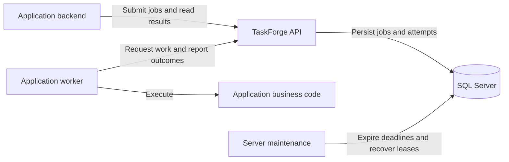

# TaskForge

[](https://github.com/Arvence/TaskForge/actions/workflows/ci.yml)

TaskForge is an HTTP job orchestration server built with .NET and SQL Server.
Applications submit background work, execute it in their own processes, and query
its progress. TaskForge stores jobs and attempt history, assigns work to compatible
clients, and manages retries, deadlines, and cancellation.

Use it to move work such as report generation or service requests out of an HTTP
request while keeping a durable record of what happened. Business code stays in
the application that owns it. Any language can integrate through HTTP; the .NET
SDK provides a client, typed handlers, and a hosted worker.

## How it works


```mermaid
flowchart LR
    App[Application backend] -->|Submit jobs and read results| API[TaskForge API]
    Worker[Application worker] -->|Request work and report outcomes| API
    Worker -->|Execute| Handler[Application business code]
    API -->|Persist jobs and attempts| SQL[(SQL Server)]
    Maintenance[Server maintenance] -->|Expire deadlines and recover leases| SQL
```

Workers request jobs for an application ID and a set of supported types. Each
assignment includes a job ID, attempt ID, worker ID, payload, and fixed deadline.
The worker executes its local handler and reports success or failure. TaskForge
never invokes application callbacks or runs business handlers inside the API.

- **Durable execution records:** jobs, results, errors, and individual attempts.
- **Controlled distribution:** application/type routing, priorities, and atomic acquisition.
- **Recovery:** capped retry backoff, timeout handling, dead-lettering, and manual replay.
- **Safe reporting:** duplicate acknowledgments and rejection of stale or conflicting outcomes.
- **Client integration:** plain HTTP, an independent .NET SDK, and a runnable sample client.

See [architecture and job lifecycle](docs/architecture.md) for execution semantics
and project dependencies.

## Run locally

Requires Git, a stable **.NET 10 SDK**, Docker with Compose v2 and Linux containers,
and PowerShell. Use Windows PowerShell 5.1 or PowerShell 7; on Linux, use PowerShell 7.
The server runs in Docker. The sample worker runs on your host.

### Start the server

```powershell
git clone https://github.com/Arvence/TaskForge.git
cd TaskForge
./setup.ps1
```

Setup checks Docker, creates `.env` when needed, and prompts for a SQL Server
password. Accept `Start TaskForge now? [Y/n]` to build and start the services.
It waits for database connectivity at [http://localhost:8275/api/ready](http://localhost:8275/api/ready).
Existing configuration and database data are preserved.

If Windows blocks the script, run
`powershell -NoProfile -ExecutionPolicy Bypass -File ./setup.ps1`.
For direct Compose setup without PowerShell, see [server configuration](docs/architecture.md#server-configuration).

### Start the sample worker

From the repository root, in the first terminal:

```powershell
dotnet build TaskForge.sln --configuration Release
$env:TaskForge__ApplicationId = 'a-project'
dotnet run --project samples/TaskForge.SampleClient --configuration Release --no-build -- run
```

Leave this terminal open. The sample handles `generate-report` and `http-request`
jobs. Without a matching worker, new jobs remain queued.

### Submit a report and inspect the result

In a second PowerShell terminal, from the repository root:

```powershell
$env:TaskForge__ApplicationId = 'a-project'
$submitted = dotnet run --project samples/TaskForge.SampleClient --configuration Release --no-build -- submit-report | ConvertFrom-Json
if ($LASTEXITCODE -ne 0) { throw 'Report submission failed.' }

$api = 'http://localhost:8275'
$deadline = [DateTimeOffset]::UtcNow.AddSeconds(30)
do {
    $job = Invoke-RestMethod "$api/api/jobs/$($submitted.id)"
    if ($job.status -in @('Completed', 'DeadLettered', 'Cancelled')) { break }
    Start-Sleep -Milliseconds 250
} while ([DateTimeOffset]::UtcNow -lt $deadline)
if ($job.status -ne 'Completed') { throw "Expected Completed; got $($job.status)." }

$job.result | ConvertTo-Json -Depth 5
$attempts = Invoke-RestMethod "$api/api/jobs/$($job.id)/attempts"
$attempts | Format-Table attemptNumber, outcome, workerId, durationMilliseconds -AutoSize
```

The report has three entries totaling **190.25**, grouped into Supplies (**40.25**)
and Travel (**150.00**). The first attempt is `Succeeded`, with `retryCount: 0`.
The sample guide covers [custom reports, HTTP jobs, and multiple clients](docs/dotnet-client.md#sample-client).

Stop the worker with Ctrl+C. Stop the server with `docker compose down`; the SQL
named volume retains your jobs. Adding `--volumes` deletes that data.

## Integrate with an application

| Integration | What to use |
| --- | --- |
| .NET | [SDK and hosted worker](docs/dotnet-client.md): register local handlers and use `TaskForgeClient`. |
| Node.js, Python, or another language | [HTTP API](docs/http-api.md): submit, acquire, execute locally, and report. No callback endpoint is required. |
| Postman or another API client | Import the running server's [OpenAPI document](http://localhost:8275/openapi/v1.json). |
| Local inspection | [Read-only console](docs/dotnet-client.md#debugging-console) for health, statistics, and job lists. |

The application decides when to submit work. TaskForge schedules retries of
submitted jobs; it does not schedule recurring application tasks. Workers can run
inside a backend service or as separate processes.

## Execution and deployment boundaries

- **Trusted networks:** the API has no authentication or authorization. Application
  IDs route work; they do not restrict access to job data or management operations.
- **Repeated execution:** retries and crash recovery can repeat business effects.
  Handlers must enforce idempotency where needed; TaskForge does not guarantee
  exactly-once external effects.
- **Cooperative cancellation:** canceling a job prevents further accepted work on
  that assignment, but cannot forcibly stop remote code.
- **Bounded results:** serialized results are limited to 4,000 characters. Store
  large outputs in application-owned storage and return a reference.
- **Deployment scope:** the supplied configuration runs one API instance with SQL
  Server. The test suite does not establish multi-instance or production-scale capacity.

## Build and test

Run from the repository root with .NET 10 and Docker running:

```powershell
dotnet build TaskForge.sln --configuration Release
dotnet test tests/TaskForge.UnitTests --configuration Release --no-build
dotnet test tests/TaskForge.IntegrationTests --configuration Release --no-build
docker build --tag taskforge-api:local .
```

Unit tests run without Docker. Integration tests create a disposable SQL Server
container and isolated databases; they cover HTTP contracts, concurrent ownership,
recovery, SDK reporting, and independent sample processes. The normal Compose
database is not used by these tests.

[CI](.github/workflows/ci.yml) builds and runs unit tests on Windows, then builds
and runs SQL integration tests and the Docker image build on Ubuntu.

## License

[MIT](LICENSE)
