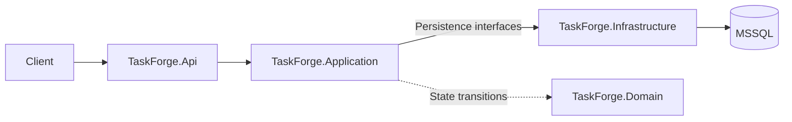
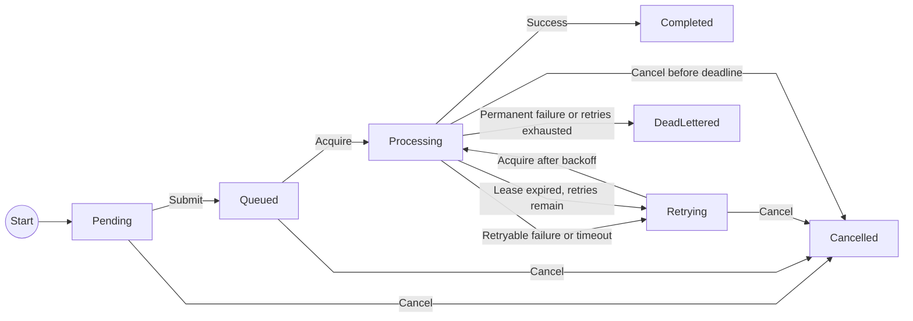

# TaskForge

TaskForge is a .NET 10 background job orchestration server backed by Microsoft SQL
Server (MSSQL). Applications submit work over HTTP; external execution clients
acquire jobs, run their own business code, and report outcomes. TaskForge owns
persistent state, retries, timeouts, cancellation, and execution history.

## Key Features

- Persistent jobs and execution attempts using EF Core and MSSQL.
- Application-scoped, priority-based assignment to compatible external clients.
- Timeouts, capped exponential retries, dead-letter handling, and cancellation.
- Idempotent submission, optimistic concurrency, and expired-lease recovery.
- Filtered and paginated job lists, execution attempt history, and job statistics.
- Optional independent .NET HTTP client in `TaskForge.SDK`.
- Local sample client with client-owned expense-report and HTTP handlers.
- Docker Compose setup, automated tests, and GitHub Actions CI.

## Quick Start

### Requirements

- Git to clone the repository.
- Docker Desktop with Docker Compose v2, running in Linux container mode.
- PowerShell 5.1 or later.
- Optional: an HTTP client such as Postman, Bruno, or curl for manual API testing.

TaskForge and SQL Server run in containers. You do not need to install .NET or
SQL Server locally.

### Built With

- .NET 10 / ASP.NET Core
- Entity Framework Core 10
- SQL Server 2022
- Docker / Docker Compose
- PowerShell

### Quick Start Flow


```mermaid
flowchart LR
    Clone["Clone repository"] --> Setup["Run ./setup.ps1"]
    Setup --> Docker["Docker starts<br/>TaskForge + SQL Server"]
    Docker --> Ready["GET /api/ready"]
    Ready --> Submit["POST /api/jobs"]
    Submit --> Store["Job stored<br/>in SQL Server"]
    Store --> Worker["External client acquires<br/>and executes job"]
    Worker --> Track["GET /api/jobs/{id}"]
    Track --> Status["Completed / Retrying / DeadLettered"]
```

### 1. Clone the repository

```powershell
git clone https://github.com/Arvence/TaskForge.git
cd TaskForge
```

### 2. Run the setup

```powershell
./setup.ps1
```

Setup checks Docker, creates `.env` from `.env.example` when needed, and securely
prompts for a SQL Server password if one is not configured. It preserves existing
configuration; use the original SA password if a database volume already exists.

Accept `Start TaskForge now? [Y/n]` to build and start the containers. Setup waits
for SQL Server health and API readiness, then prints the local URLs. The API uses
port `8275`. Maintenance starts automatically; business execution requires an
external client.

If Windows blocks the script, run
`powershell -NoProfile -ExecutionPolicy Bypass -File ./setup.ps1`.

### 3. Verify TaskForge

GET [http://localhost:8275/api/ready](http://localhost:8275/api/ready)

```powershell
Invoke-RestMethod http://localhost:8275/api/ready
```

Expect `200 OK` with `{"status":"Ready"}` before submitting jobs.

### 4. Submit a job

`POST http://localhost:8275/api/jobs` with `Content-Type: application/json`:

```powershell
$body = @'
{
  "applicationId": "example-app",
  "type": "http-request",
  "priority": "Normal",
  "payload": {
    "url": "http://localhost:8275/api/health",
    "method": "GET"
  },
  "maxRetries": 3,
  "timeoutSeconds": 30
}
'@

$job = Invoke-RestMethod http://localhost:8275/api/jobs -Method Post -ContentType 'application/json' -Body $body
$job.id
```

TaskForge persists the job in SQL Server and returns `201 Created` with its ID.
The job remains queued until an external client supporting `http-request` requests
it through `POST /api/executions/wait`. The example URL is resolved by that client.
TaskForge does not execute HTTP requests or any other business handler.

### 5. Track the job

`GET http://localhost:8275/api/jobs/{id}`; replace `{id}` with the returned job ID.
In the same PowerShell session:

```powershell
Invoke-RestMethod "http://localhost:8275/api/jobs/$($job.id)" | ConvertTo-Json -Depth 5
```

- Success: `Queued → Processing → Completed`.
- Retry: `Queued → Processing → Retrying → Processing → Completed`.
- Permanent failures or exhausted retries end in `DeadLettered`.

Without an execution client, the job stays `Queued`. After a client reports
success, it becomes `Completed` and exposes the result supplied by that client.

### 6. Inspect execution history

`GET http://localhost:8275/api/jobs/{id}/attempts`

```powershell
Invoke-RestMethod "http://localhost:8275/api/jobs/$($job.id)/attempts" | ConvertTo-Json -Depth 5
```

This returns execution attempts in order, including retry history, outcomes,
timings, and errors. A job that has not been acquired has no attempts.

### 7. Stop TaskForge

```powershell
docker compose down
```

The SQL Server named volume preserves jobs and execution history.
Do not add `--volumes` unless you intend to delete that data.

## Architecture / Request Flow


```mermaid
---
config:
  flowchart:
    curve: linear
---
flowchart LR
    Client --> API["TaskForge.Api"]
    API --> App["TaskForge.Application"]
    App -->|Persistence interfaces| Infra["TaskForge.Infrastructure"]
    Infra --> DB[("MSSQL")]
    App -.->|State transitions| Domain["TaskForge.Domain"]
```

- **Api:** HTTP endpoints, dependency registration, and hosting for maintenance.
- **Application:** envelope validation, job workflows, and execution orchestration;
  depends on persistence interfaces rather than EF Core.
- **Domain:** job states, attempt outcomes, and lifecycle rules.
- **Infrastructure:** EF Core persistence and SQL Server migrations.

A submission is validated, queued, and saved before the API returns its ID.
External clients acquire eligible jobs and report completion or failure through
the server protocol. Maintenance recovers expired executions even when no clients
are connected. Submission validates the envelope and JSON, not business payloads.
Types such as `send-email` require no server-side implementation.

The server contains no in-process executor, worker manager, business handlers, or
local cancellation callbacks. Acquisition creates ownership and an attempt together;
execution reports and cancellation use guarded server transitions. Historical worker
tables remain mapped for database compatibility, and maintenance still reconciles
jobs left by the retired execution model.

## Job Lifecycle


```mermaid
---
config:
  flowchart:
    curve: linear
---
flowchart LR
    Start((Start)) --> Pending
    Pending -->|Submit| Queued
    Queued -->|Acquire| Processing
    Processing -->|Success| Completed
    Processing -->|Retryable failure or timeout| Retrying
    Retrying -->|Acquire after backoff| Processing
    Processing -->|Permanent failure or retries exhausted| DeadLettered
    Processing -->|Lease expired, retries remain| Retrying
    Pending -->|Cancel| Cancelled
    Queued -->|Cancel| Cancelled
    Retrying -->|Cancel| Cancelled
    Processing -->|Cancel before deadline| Cancelled
```

`Pending` is the initial domain state; accepted submissions are stored as
`Queued`. Retries wait for their backoff before becoming eligible again.
A due retry remains `Retrying` until acquisition commits it as `Processing`
together with a new attempt.

Server maintenance expires running attempts on polls at or after
`startedAtUtc + timeoutSeconds`, using SQL Server time without waiting for lease
grace or a client report. Each poll checks up to 100 due executions and rechecks
ownership, cancellation, and the deadline transactionally before recording a
timeout. Expiration applies the normal retry budget and backoff, or dead-letters
an exhausted job. Maintenance runs without connected clients and retries after
database failures.

Lease recovery applies the timeout retry budget and backoff to interrupted work,
ending in `DeadLettered` when retries are exhausted. Requested cancellation wins
and becomes `Cancelled` without consuming a retry. Cancelling a running job before
its deadline atomically cancels the job and running attempt and clears ownership.
Cancellation uses persistent server state and does not require a connected client.
It does not confirm that remote code has stopped. If the deadline has passed,
timeout is resolved first: cancellation then cancels the retrying job, or returns
`409` if timeout exhausted its retries. Complete and Fail reject cancelled executions.

## API Endpoints

| Method | Endpoint | Description |
| --- | --- | --- |
| `POST` | `/api/jobs` | Submit a job, optionally with an `Idempotency-Key` header. |
| `GET` | `/api/jobs` | Filter by status, type, or priority; paginate newest-first results. |
| `GET` | `/api/jobs/{id}` | Retrieve a job's state and result. |
| `GET` | `/api/jobs/{id}/attempts` | Retrieve attempts in ascending attempt-number order. |
| `POST` | `/api/jobs/{id}/cancel` | Request cancellation of an unfinished job. |
| `POST` | `/api/jobs/{id}/retry` | Replay a dead-lettered or cancelled job as a new job. |
| `POST` | `/api/executions/wait` | Wait for one committed execution assignment, or return `204`. |
| `POST` | `/api/jobs/{jobId}/attempts/{attemptId}/complete` | Report completion or acknowledge an identical accepted report. |
| `POST` | `/api/jobs/{jobId}/attempts/{attemptId}/fail` | Report failure using server-owned retry policy. |
| `GET` | `/api/workers` | Retired; returns `410 Gone`. |
| `PUT` | `/api/workers/count` | Retired; returns `410 Gone`. |
| `GET` | `/api/stats` | Get current job counts and success rate. |
| `GET` | `/api/health` | Check application liveness without querying the database. |
| `GET` | `/api/ready` | Check database connectivity; returns `200` or `503`. |
| `GET` | `/openapi/v1.json` | Read the generated OpenAPI document. |
| `GET` | `/` | Redirect to `/api/health`. |

Job lists return `items`, `page`, `pageSize`, `totalCount`, and `totalPages`.
Pages start at `1`; page size defaults to `50` and accepts `1`–`100`.
For example: `GET /api/jobs?status=Queued&priority=High&page=1&pageSize=25`.

### Wait for work

`POST /api/executions/wait` is available in normal API startup:

```json
{
  "applicationId": "billing",
  "workerId": "worker-01",
  "supportedTypes": ["generate-report"],
  "waitSeconds": 20
}
```

Application IDs use the existing trim/lowercase normalization. Worker IDs must
be nonblank and at most 200 characters; their exact spelling is preserved.
Provide 1 to 100 supported types, each nonblank and at most 100 characters.
Matching types is case-insensitive. `waitSeconds` accepts integers from 0 to 30,
defaults to 20, and uses 0 for a single immediate acquisition attempt.
Invalid input returns `400` before polling the database.

Success returns `200` with `jobId`, `applicationId`, `attemptId`, `attemptNumber`,
`workerId`, `type`, the JSON `payload`, `timeoutSeconds`, `startedAtUtc`,
`deadlineAtUtc`, and `leaseExpiresAtUtc`. The job and attempt are already committed
when returned. Only compatible jobs from the requested application are eligible;
the existing priority, due-retry, and creation ordering applies. If no assignment
is available before the wait expires, the response is `204` with no body.

Retry eligibility and assignment timestamps use SQL Server UTC, matching execution
reporting. Acquisition locks and rechecks the selected job before reading its start
time, so selection and ownership lock waits do not consume the execution timeout.
Retries refresh that time. The deadline remains `startedAtUtc + timeoutSeconds`,
and the lease adds the configured grace period. Commit and response delivery take
place after the start time; clients must honor the returned deadline.

Polling occurs every 500 ms, with a fresh database scope per attempt. Connections
and transactions are released before waiting. Request disconnects and host shutdown
cancel pending acquisition and delays. The wait limit also cancels an in-flight
database acquisition; a zero-second wait still allows its one database operation
to finish. A claim committed before a disconnect or lost acknowledgement remains
owned until normal deadline and lease recovery. Neither HTTP delivery nor an
uncertain commit is automatically replayed to claim another job. Clients should
inspect existing job/attempt state after uncertain delivery rather than blindly
retrying the request; a new wait request may claim different work.

Wait, Complete, and Fail are registered in normal startup. The server has no local
executor, worker manager, business handlers, or process-local cancellation signal.
`Worker:Count` and persisted desired worker counts are ignored. The existing
`Worker:PollIntervalMilliseconds`, `RetryDelaySeconds`, `MaxRetryDelaySeconds`, and
`LeaseGraceSeconds` settings continue to control maintenance and retry/lease policy.
The retired worker-management routes return a `410 Gone` problem response during
migration; execution capacity belongs to external clients.

## Request / Response Examples

Use `http://localhost:8275` as the base URL and replace `{id}` with a returned
job ID. Job response bodies below show selected fields; the examples illustrate
different outcomes rather than a single sequence.

### Submit a job

`POST /api/jobs` — `Content-Type: application/json`,
`Idempotency-Key: health-check-001`

Request:

```json
{
  "applicationId": "example-app",
  "type": "http-request",
  "priority": "High",
  "payload": {
    "url": "http://localhost:8275/api/health",
    "method": "GET"
  },
  "maxRetries": 3,
  "timeoutSeconds": 30
}
```

Response: `201 Created`, with a `Location` header pointing to the job.

```json
{
  "id": "a70c8b73-6bb2-4fa4-a2bb-4f5c054c7a72",
  "type": "http-request",
  "status": "Queued"
}
```

An external client must implement `http-request`; the server only stores its JSON.
Replaying the same submission and idempotency key returns
`200` with the original job; changing the submission under that key returns `409`.

### Generate an expense report

`POST /api/jobs` with `Content-Type: application/json`:

```json
{
  "applicationId": "example-app",
  "type": "generate-report",
  "payload": {
    "title": "September expenses",
    "entries": [
      { "category": "Travel", "amount": 125.50 },
      { "category": "Supplies", "amount": 40.25 },
      { "category": "Travel", "amount": 24.50 }
    ]
  },
  "maxRetries": 3,
  "timeoutSeconds": 30
}
```

An external report client can complete the job with this `result`, which is then
returned by `GET /api/jobs/{id}`:

```json
{
  "title": "September expenses",
  "entryCount": 3,
  "totalAmount": 190.25,
  "categories": [
    { "category": "Supplies", "entryCount": 1, "totalAmount": 40.25 },
    { "category": "Travel", "entryCount": 2, "totalAmount": 150.00 }
  ]
}
```

Business payload rules belong to the execution client. TaskForge accepts valid JSON
without resolving a handler; a client can report `InvalidPayload` through the Fail
endpoint to record a permanent failure. Handler implementations belong in the
execution client.

### Retrieve a job

`GET /api/jobs/{id}` — example `200 OK` response after execution:

```json
{
  "id": "a70c8b73-6bb2-4fa4-a2bb-4f5c054c7a72",
  "status": "Completed",
  "retryCount": 0,
  "result": { "statusCode": 200, "reasonPhrase": "OK" }
}
```

### Cancel a job

`POST /api/jobs/{id}/cancel` — no request body.
Example `200 OK` response for a job cancelled while queued:

```json
{
  "id": "a70c8b73-6bb2-4fa4-a2bb-4f5c054c7a72",
  "status": "Cancelled",
  "cancellationRequested": true
}
```

Repeated cancellation of a cancelled job returns `200` without changing it.
An unknown job returns `404`; a completed or dead-lettered job or a conflicting
update returns `409`.

### Replay a job

`POST /api/jobs/{id}/retry` requires no request body. Only `DeadLettered` and
`Cancelled` jobs can be replayed. Success returns `201 Created`, the new job,
and a `Location` header pointing to `/api/jobs/{newId}`.

Replay uses normal submission validation and persistence, preserving the type,
payload, priority, maximum retries, and timeout. The new job is queued immediately
with a new ID and timestamps, zero retries, no cancellation request, and no
execution attempts. The original job and its attempt history remain unchanged.
External clients acquire the new job through the wait endpoint; automatic retries are
unchanged and apply independently to the new job.

The original idempotency key is not copied: the new job's `idempotencyKey` is
`null`. This endpoint ignores the `Idempotency-Key` header. Every successful call,
including repeated or concurrent calls for the same source, creates a separate job.

An unknown job returns `404`. All other states, including `Completed`, return
`409` with a message and the source status. If the saved definition no longer
passes current submission validation, the endpoint returns a `400` validation
problem without creating a job.

### Inspect execution attempts

`GET /api/jobs/{id}/attempts` — example `200 OK` response:

```json
[
  {
    "jobId": "a70c8b73-6bb2-4fa4-a2bb-4f5c054c7a72",
    "attemptId": "c8b59454-9eb3-4720-8fef-f008e7a3d0e6",
    "attemptNumber": 1,
    "workerId": "client-1",
    "startedAtUtc": "2026-09-17T12:00:00Z",
    "deadlineAtUtc": "2026-09-17T12:00:30Z",
    "finishedAtUtc": "2026-09-17T12:00:00.250Z",
    "durationMilliseconds": 250,
    "outcome": "Succeeded",
    "errorCode": null,
    "errorMessage": null
  }
]
```

Outcomes are `Running`, `Succeeded`, `Failed`, `PermanentlyFailed`, `TimedOut`,
`Cancelled`, or `Abandoned`. Running attempts have no finish time or duration.
A job with no executions returns `[]`; a missing job returns `404`.
`attemptId` is the persisted identity used in Complete/Fail URLs. `deadlineAtUtc`
is derived from that attempt's start plus the job's timeout, including for historical
attempts. Lease grace does not extend the execution deadline. Existing fields and
ascending attempt-number ordering are preserved.

### Report an execution

After acquiring work through `POST /api/executions/wait`, use the returned
`jobId`, `attemptId`, and exact `workerId` to report the client-owned execution:

```http
POST /api/jobs/{jobId}/attempts/{attemptId}/complete
Content-Type: application/json

{"applicationId":"my-app","workerId":"client-1","result":{"ok":true}}
```

An omitted or JSON `null` result is accepted. Other JSON results must fit within
4,000 characters after compact serialization. To report a failure:

```http
POST /api/jobs/{jobId}/attempts/{attemptId}/fail
Content-Type: application/json

{"applicationId":"my-app","workerId":"client-1","errorCode":"Temporary","errorMessage":"The dependency is unavailable."}
```

The server decides retries, backoff, and exhaustion. `InvalidPayload`,
`UnsupportedJobType`, and `NonRetryableJobException` are permanent errors.
Both operations return `200` with the current job for an accepted report or an
identical previously accepted report. Duplicate reports do not rewrite history
or consume another retry; a historical failure duplicate can return a job that
has since moved to a later attempt.

Reports for timed-out attempts return `409` Problem Details with
`code: "AttemptTimedOut"`, including after a newer attempt starts. Once timeout
has been recorded, these reports leave the current assignment and history unchanged.

| Response | Contract |
|---|---|
| `400` | `application/problem+json`; validation errors include an `errors` dictionary. Malformed JSON or binding errors use the same media type without field validation details. |
| `404` | Report Problem Details indicate that the application/job/attempt combination was not found. |
| `409` | Report Problem Details identify a stale, conflicting, cancelled, or timed-out execution. A late first report can persist the timeout transition. |
| `415` | Problem Details for a body with an unsupported content type. |
| `500` | Generic Problem Details without internal exception details. |

Existing job lookup/replay/cancellation errors retain their JSON `message`;
terminal-state conflicts also include `status`. Submission idempotency conflicts
retain `message` and `idempotencyKey`. Readiness retains its `status` body with
`200` or `503`. Full response schemas are available at `/openapi/v1.json`.

Submission, acquisition, reporting, job/history reads, cancellation, replay,
listing, statistics, and readiness can all be validated over HTTP without an SDK.

### Get job statistics

`GET /api/stats` — example `200 OK` response:

```json
{
  "totalJobs": 10,
  "countsByStatus": {
    "pending": 0,
    "queued": 1,
    "processing": 1,
    "retrying": 0,
    "completed": 6,
    "deadLettered": 2,
    "cancelled": 0
  },
  "successRatePercent": 75
}
```

Statistics describe current job states, not execution attempts. Success rate is
`completed / (completed + deadLettered) * 100`, rounded to two decimal places;
it is `null` when neither outcome exists.

## Optional .NET Client

`src/TaskForge.SDK` targets .NET 10 and has no server project references. Its
handler registry and optional worker use the Microsoft.Extensions dependency
injection and hosting abstractions packages.
Reference `TaskForge.SDK.csproj` from a .NET application to use the typed HTTP
client. Direct HTTP clients remain supported.

```csharp
using System.Text.Json;
using TaskForge.SDK;
using TaskForge.SDK.Jobs;

using HttpClient http = new() { Timeout = Timeout.InfiniteTimeSpan };
TaskForgeClient client = new(http, new TaskForgeClientOptions
{
    BaseUrl = new Uri("http://localhost:8275"),
    ApplicationId = "a-project"
});

JobResponse job = await client.SubmitAsync(
    new SubmitJobRequest("add-numbers", JsonSerializer.SerializeToElement(new { left = 20, right = 22 })),
    idempotencyKey: "addition-001");

ExecutionAssignmentResponse? assignment = await client.WaitAsync(
    new WaitForExecutionRequest("worker-01", ["add-numbers"], WaitSeconds: 20));

if (assignment is not null)
{
    int sum = assignment.Payload.GetProperty("left").GetInt32() + assignment.Payload.GetProperty("right").GetInt32();
    await client.CompleteAsync(assignment.JobId, assignment.AttemptId,
        new CompleteExecutionRequest(assignment.WorkerId, JsonSerializer.SerializeToElement(new { sum })));
}

JobResponse persisted = await client.GetJobAsync(job.Id);
IReadOnlyList<JobAttemptResponse> history = await client.GetAttemptsAsync(job.Id);
```

`FailAsync(jobId, attemptId, new FailExecutionRequest(workerId, errorCode, errorMessage))`
reports an execution failure; `CancelAsync(jobId)` requests server cancellation.
Every operation accepts a `CancellationToken`. Submission, acquisition, and reports
use the configured application ID, trimmed and lowercased. Job/history reads and
cancellation use the server's existing job-ID routes. Payloads and results are
`JsonElement` values, and protocol enums use JSON strings. A `204` wait returns
`null`.

The caller owns the injected `HttpClient`; the SDK neither disposes it nor changes
its base address, timeout, or default headers. `RequestTimeout` defaults to 30
seconds and covers sending and reading the response. Wait requests use the greater
of that timeout and `WaitSeconds + 10` seconds; supported waits are 0 through 30
seconds. Set the injected client's timeout to infinite as above, or at least the
SDK request budget (40 seconds for the maximum wait). A shorter injected timeout
is rejected before sending. SDK timeouts throw `TimeoutException`; caller
cancellation remains `OperationCanceledException`.

Non-success responses throw `TaskForgeApiException`, retaining `StatusCode`,
`ResponseBody`, and a typed `Error` with the original `Code`, `Detail`, `Message`,
validation `Errors`, and additional JSON fields. For example,
`exception.Error.Code == "AttemptTimedOut"` identifies a timed-out attempt.
Responses without a code retain their original detail/message and a null code;
non-JSON errors still preserve the raw response body. Transport errors remain
`HttpRequestException`.

`TaskForgeClient` sends each request once. The optional hosted worker described
below automates waiting and invocation. An application executes only assignments
returned by the server; server retry counts do not instruct it to rerun a handler.

### Client-owned handler registration

Implement `IJobHandler<TPayload>` in the client application. Its
`HandleAsync(TPayload payload, CancellationToken cancellationToken)` method returns
`Task<JsonElement?>`; return null when the handler has no result. Payload DTOs,
business implementations, and their dependencies belong to the application.

Configure mappings once on the application's DI service collection before building
its host or service provider:

```csharp
using Microsoft.Extensions.DependencyInjection;
using TaskForge.SDK.Handlers;

services.AddTaskForgeHandlers(handlers => handlers
    .Register<SendEmailPayload, SendEmailHandler>("send-email")
    .Register<GenerateReportPayload, GenerateReportHandler>("generate-report"));
```

The example handler and payload types are supplied by the client. Use the DI
container supplied by the application's .NET host, or add
`Microsoft.Extensions.DependencyInjection` when constructing a console app's
service provider directly.

`JobHandlerRegistry` is a singleton with mappings frozen when
`AddTaskForgeHandlers` returns. Retaining the builder does not permit later
registration. Duplicate type strings, including casing or surrounding-whitespace
variants, throw during startup. Type names are trimmed, limited to 100 characters,
and matched case-insensitively. `RegisteredTypes` is a read-only, sorted list usable
directly in wait requests:

```csharp
JobHandlerRegistry registry = serviceProvider.GetRequiredService<JobHandlerRegistry>();
ExecutionAssignmentResponse? assignment = await client.WaitAsync(
    new WaitForExecutionRequest("worker-01", registry.RegisteredTypes));

if (assignment is not null)
{
    JsonElement? result = await registry.ExecuteAsync(assignment);
    await client.CompleteAsync(assignment.JobId, assignment.AttemptId,
        new CompleteExecutionRequest(assignment.WorkerId, result));
}
```

Each `ExecuteAsync` call deserializes the payload locally and creates an async DI
scope for one handler invocation. Handler types are registered as scoped by default;
existing scoped or transient factories are respected, while singleton handler
registrations are rejected. Keep those handler lifetimes when configuring DI.
Handlers and scoped dependencies are disposed before the call returns, including
on failure or cancellation. JSON results are cloned before scope disposal.

Handlers and their scoped dependencies can accept `JobExecutionContext` from
`TaskForge.SDK.Execution` through constructor injection. It is an immutable snapshot
of the assignment's `JobId`, `ApplicationId`, `AttemptId`, `AttemptNumber`, `WorkerId`,
`JobType`, `StartedAtUtc`, and `DeadlineAtUtc`. The SDK initializes it before creating
the handler. Each invocation has its own context, including concurrent slots.
The hosted worker supplies it automatically; manual callers use
`registry.ExecuteAsync(assignment, cancellationToken)` as above. The existing
`ExecuteAsync(jobType, payload, cancellationToken)` overload remains available for
payload-only handlers. Resolving a context through that overload fails clearly
because no execution identity was supplied.

Payload deserialization uses System.Text.Json web defaults, respects required
constructor parameters and nullable annotations, and honors DTO serialization
attributes. Use required properties or required constructor parameters for fields
that must be present. Null, undefined, or incompatible payloads throw
`InvalidJobPayloadException` before handler resolution; the exception retains the
payload type and underlying `JsonException`. Missing mappings throw
`JobHandlerNotFoundException`. Business validation and handler exceptions remain
application-owned.

The registry performs no HTTP requests or automatic result reporting. The caller
can invoke a returned assignment and report Complete or Fail directly, or opt into
the hosted worker below. Mappings stay in the client process.

### Optional hosted execution

Register `AddTaskForgeWorker` in a .NET host to automate wait, local invocation,
and Complete/Fail reporting. Register one `TaskForgeClient` and the handler registry
in the same service collection. A console application using this example also
needs the `Microsoft.Extensions.Hosting` package:

```csharp
using Microsoft.Extensions.DependencyInjection;
using Microsoft.Extensions.Hosting;
using TaskForge.SDK;
using TaskForge.SDK.Execution;
using TaskForge.SDK.Handlers;

HostApplicationBuilder builder = Host.CreateApplicationBuilder(args);
using HttpClient http = new() { Timeout = Timeout.InfiniteTimeSpan };
builder.Services.AddSingleton(new TaskForgeClient(http, new TaskForgeClientOptions
{
    BaseUrl = new Uri("http://localhost:8275"),
    ApplicationId = "a-project"
}));
builder.Services.AddTaskForgeHandlers(handlers => handlers
    .Register<SendEmailPayload, SendEmailHandler>("send-email"));
builder.Services.AddTaskForgeWorker();

using IHost host = builder.Build();
await host.RunAsync();
```

`TaskForgeWorkerOptions` defaults to one execution slot, 20-second waits, a
250-millisecond delay after `204 No Content`, and a one-second delay after transient
communication failures. Pass an options record to `AddTaskForgeWorker` to change
`SlotCount`, `WaitSeconds` (0–30), `NoWorkDelay`, or `TransportErrorDelay`. Cancellation
coordination adds `StatusPollInterval` (one second by default) and `ShutdownTimeout`
(ten seconds by default). `ReportRetryCount` allows 0–100 additional outcome delivery
attempts and defaults to three. All durations must be positive. The worker requires 1–100
registered types, matching the wait protocol.

Each startup creates a random session identifier; each slot appends its own number
to form a worker ID. The slot waits using the client's configured application and
the registry's type names. It invokes at most one handler at a time, disposes that
execution scope, and reports using the assignment's exact job, attempt, and worker
IDs before waiting again. Application or worker identity mismatches stop the hosted
worker and cancel its other slots without invoking or reporting the bad assignment.

Handlers retain the `Task<JsonElement?>` contract. The worker serializes the returned
JSON before reporting, checks the server's compact 4,000-character limit, and reports
local failures with these codes:

| Local failure | Reported error code |
| --- | --- |
| Payload deserialization | `InvalidPayload` |
| Missing handler mapping | `UnsupportedJobType` |
| `NonRetryableJobException` from client code | `NonRetryableJobException` |
| Unreadable, undefined, or oversized result; `JobResultSerializationException` | `ResultSerializationFailed` |
| Other handler, activation, or scope-disposal exception | Exception type name, such as `InvalidOperationException` |

The first three codes use the server's existing permanent-failure policy. All other
codes remain subject to its retry budget. Error codes and messages fit the server's
100- and 4,000-character limits; result JSON is never truncated. A handler that
serializes a business object itself can wrap conversion errors in
`JobResultSerializationException` to classify them as result failures.

The worker does not resubmit jobs, calculate business retry times, or interpret
returned retry counts as instructions to invoke again. Only a new assignment can
trigger another execution. Communication failures do not become handler failures:
a failed Complete request never causes a contradictory Fail request. Definitive
`404`/`409` report rejections are logged and the slot resumes waiting. Network
failures, request timeouts, `408`, `429`, and `5xx` responses use the transport delay.
For waits, the worker starts another wait after that delay; it does not replay an
acquisition through an HTTP retry policy. Other protocol/configuration failures,
including `400`, fault the hosted service and follow the application's host failure
policy without retrying the rejected request.

### Outcome delivery retries

After a handler exits, its slot retains the exact Complete or Fail request in memory
until acknowledgement, definitive rejection, or the delivery limit. A lost response,
temporary connection failure, response-stream I/O failure, request timeout, `408`,
`429`, or `5xx` triggers at most `ReportRetryCount` additional deliveries, separated
by `TransportErrorDelay`. Every delivery uses the same application, job, attempt,
worker, and outcome body. An acknowledged duplicate is success, even if a duplicate
Fail response describes a newer job state. The returned retry count never tells the
SDK to invoke a handler again.

The slot does not acquire more work during delivery retries, and the disposed handler
scope is not recreated. A failed Complete never becomes a business Fail. `404` and
`409` end reporting, including stale, timed-out, cancelled, or conflicting attempts.
The original assignment deadline cancels retry backoff and in-flight delivery;
shutdown also stops delivery. A handler that ignored cancellation and finished after
its deadline can still send its original late report once, as described below, but
that report is not retried.

Transport backoff is independent of the server's job retry schedule and consumes no
additional job retry budget. When delivery retries are exhausted, the slot resumes
waiting for server assignments. If the report was accepted, persisted state remains
authoritative; otherwise server timeout/recovery can redistribute the job. Pending
reports are lost on process exit. There is no durable client outbox, and business
handlers must still tolerate re-execution in a later server-assigned attempt.

### Cancellation, deadlines, and shutdown

The handler receives a linked token covering host shutdown, the assignment's fixed
`DeadlineAtUtc`, and cancellation observed through `GET /api/jobs/{jobId}`. Status
polling runs alongside the handler at `StatusPollInterval`. It also stops local work
when the job no longer has the assignment's processing owner and start time. These
are read-only requests: they do not renew leases or extend deadlines. Transient read
failures are logged and polling continues while the original deadline remains in
effect; an in-flight read is cancelled when local execution stops.

The worker calculates the remaining UTC deadline once when accepting the assignment
and schedules a one-shot timer. Delivery time already consumed is excluded. An
expired assignment is not invoked. The local budget is capped by the assignment's
original duration and `TimeoutSeconds`, so a slow local clock cannot grant an
unbounded extension. Subsequent wall-clock changes do not restart the timer, and
lease grace is never execution time. Client clocks should be synchronized: clock
skew can make local cancellation early or late, while the server's clock decides whether
a report is timely.

When a handler cooperates with this token and throws `OperationCanceledException`,
the SDK disposes its scope without inventing a timeout status or business failure.
Server cancellation, deadline maintenance, and recovery determine persisted state.
Cancellation of an unrelated operation inside a handler still follows ordinary
failure reporting when the execution token has not been cancelled.

Host shutdown immediately stops new waits and cancels active execution tokens.
`StopAsync` waits up to `ShutdownTimeout`, or the host's shorter shutdown budget.
It does not report shutdown as a business failure. If reporting is impossible,
the server recovers unreported work through its existing deadline/recovery paths.

A handler that ignores cancellation keeps its slot and DI scope until its actual
invocation exits, even if bounded shutdown waiting has already returned. The SDK
does not force thread termination or start overlapping work in that slot. While
the process remains alive, resources are disposed when the handler exits. Outside
host shutdown, an eventual result or failure is reported with the original attempt
identity; the server rejects timed-out, cancelled, or stale reports normally. During
shutdown, the SDK does not attempt a late report or acquire another assignment.

## Local Sample Client

`samples/TaskForge.SampleClient` is a separate .NET 10 executable. Its only project
reference is `TaskForge.SDK`; business handlers and HTTP options live in the sample.
The API image contains neither the sample nor the SDK and cannot execute these
handlers. The sample defaults to application `a-project` and API
`http://localhost:8275`.

Its report wrapper logs the application, job, attempt, and worker from the scoped
execution context. The deterministic report result remains independent of these
identifiers, so repeated attempts can produce identical business output.

With the local stack running, build the solution and start the client in a terminal:

```powershell
docker compose up --build -d --wait --wait-timeout 180
dotnet build TaskForge.sln --configuration Release
dotnet run --project samples/TaskForge.SampleClient --configuration Release --no-build -- run
```

In another terminal, use the application's submission commands:

```powershell
dotnet run --project samples/TaskForge.SampleClient --configuration Release --no-build -- submit-report
dotnet run --project samples/TaskForge.SampleClient --configuration Release --no-build -- submit-http http://localhost:8275/api/health
```

Each submission prints JSON containing the job ID. `submit-report` uses the expense
example above and produces a total of `190.25`; an optional JSON file supplies a
different payload containing `title` and `entries`. `submit-http` submits a GET.
Submission commands exit without starting a worker. Read the result and history
using `GET /api/jobs/{id}` and `GET /api/jobs/{id}/attempts`.

Stop the `run` process with Ctrl+C, then submit another job. With no other compatible
client running, it stays `Queued` with an empty attempt history until a client starts.
When submitting the API examples above directly, set `applicationId` to `a-project`
to route them to this sample. Starting the sample also acquires any existing eligible
jobs for that application and its two registered types.

Configuration is loaded from `clientsettings.json` beside the executable. Edit
`samples/TaskForge.SampleClient/clientsettings.json` and rebuild, or override values
with `TaskForge__BaseUrl`, `TaskForge__ApplicationId`, and
`HttpRequestJobs__AllowedHosts__0` environment variables. Handler mappings are
registered once at startup. The optional SDK worker owns waiting, scoped invocation,
cancellation, and bounded outcome delivery.

The report handler groups trimmed categories using ordinal, case-sensitive order
and exact decimal totals. It accepts 1–1,000 entries, titles up to 120 characters,
categories up to 80 characters, and amounts from 0 to 1,000,000,000,000 with at most
two decimal places. Its compact, escaped JSON must fit the server's 4,000-character
result limit. An oversized result produces a permanent failure with guidance to
reduce the report; results are never truncated. It produces structured JSON.

The HTTP handler preserves the original host allowlist and failure classification.
Defaults allow only `localhost` and `127.0.0.1`; automatic redirects and cookies are
disabled. It supports GET, POST, PUT, PATCH, and DELETE, defaults omitted methods to
POST, and returns only HTTP status metadata. HTTP `408`, `429`, and `5xx` failures
use the server's ordinary retry policy; other non-success statuses and invalid
requests are permanent failures. Cancellation reaches the outgoing request. Any
side effects must tolerate a later server-assigned attempt; outcome delivery retries
do not repeat the HTTP operation. The sample does not implement email delivery.

### Independent applications and competing clients

Use separate terminals for the application instances. In the first terminal:

```powershell
$env:TaskForge__ApplicationId = "a-project"
dotnet run --project samples/TaskForge.SampleClient --configuration Release --no-build -- run
```

In the second terminal:

```powershell
$env:TaskForge__ApplicationId = "b-project"
dotnet run --project samples/TaskForge.SampleClient --configuration Release --no-build -- run
```

Run the first command in a third terminal to add another `a-project` worker. Each
process creates its own worker identity. All register `generate-report` locally;
the server distributes work by application and supported type. The two `a-project`
instances compete for assignments, and `b-project` receives its own jobs. Application
keys are routing identifiers; the API's trusted-network limitations still apply.

In a submission terminal, select the application explicitly for each submission:

```powershell
$env:TaskForge__ApplicationId = "a-project"
dotnet run --project samples/TaskForge.SampleClient --configuration Release --no-build -- submit-report
$env:TaskForge__ApplicationId = "b-project"
dotnet run --project samples/TaskForge.SampleClient --configuration Release --no-build -- submit-report
```

Compare the printed job IDs with each worker's report logs and the jobs' attempt
histories. Submission remains an application decision. Stop the workers with Ctrl+C
when finished.

### Business-side retry safety

`JobId` stays the same across retries; each new assignment has a new `AttemptId`
and an incremented `AttemptNumber`. A business operation intended to occur once per
logical job can use a key such as
`$"{context.ApplicationId}:reserve:{context.JobId:D}"`. Using `AttemptId` in that
key allows the operation to repeat on the next attempt. Replay and fresh submission
create new job IDs; use an application-owned operation ID from the payload when the
business identity must span multiple submitted jobs.

The business receiver must enforce its key together with the effect, through an
atomic record in its own storage or an idempotent downstream API. Its record must
survive relevant retries and process restarts. Checking an in-memory flag in a
worker cannot provide that protection across independent client processes.

Outcome transport retries resend the same Complete/Fail body without invoking the
handler again. A process can still exit after an external effect and before its
outcome reaches TaskForge. Server timeout recovery then permits a new attempt,
which may repeat that effect. A handler that ignores cancellation can also overlap
a replacement attempt. TaskForge does not guarantee exactly-once external side
effects or coordinate a distributed transaction with the business receiver.

The SDK integration tests run separate sample processes for two applications and
two instances of one application. Other tests give the same type name different
local results, exercise competing acquisition, and kill a real sample process after
report computation but before Complete delivery. The replacement executes the
deterministic report again with identical output and a new attempt ID. A separate
in-memory receiver test double models atomic deduplication: an application/job key
records one effect across two attempts, while an attempt-based key records two.
The test double demonstrates the key choice and is not a durable receiver.

## Debugging Console

The optional read-only console requires the .NET 10 SDK and a running TaskForge
API. Set `apiBaseUrl` in `src/TaskForge.Debugging/debugsettings.json` if the API is
not at `http://localhost:8275`, then run:

```powershell
dotnet run --project src/TaskForge.Debugging
dotnet run --project src/TaskForge.Debugging -- jobs --application-id example-app --status Queued
dotnet run --project src/TaskForge.Debugging -- --help
```

The dashboard shows API health, job counts across all applications, success rate,
and the five newest jobs. `jobs` shows up to 20 matching jobs, including their
application IDs; it also accepts `--type` and `--priority`. Statistics and job
lists are separate reads and can differ while jobs change. `N/A` means no jobs
have completed or been dead-lettered yet. The console does not execute jobs or
track connected execution clients.

## Testing & CI

Use a stable .NET 10 SDK for local development. `global.json` keeps SDK selection
within .NET 10; CI and Docker use the same major version. Unit tests run without Docker;
integration tests use real MSSQL through Testcontainers and require a running
Linux container engine.

```powershell
dotnet test tests/TaskForge.UnitTests --configuration Release
dotnet test TaskForge.sln --configuration Release
dotnet build TaskForge.sln --configuration Release
```

The [GitHub Actions workflow](.github/workflows/ci.yml) runs on pushes and pull
requests to `main`, or manually. Windows checks the Release build and unit
tests; Ubuntu runs MSSQL integration tests and builds the API Docker image.
The workflow does not publish or deploy the image.

## Known Limitations

- Intended for a trusted network; the API has no authentication. Business work
  requires external execution clients. The optional SDK provides HTTP operations;
  handler execution and polling loops remain application-owned.
- External requests can repeat after retries or lease recovery. Submission
  idempotency does not guarantee exactly-once side effects; receivers must
  tolerate duplicate calls.
- The server accepts arbitrary valid job types; clients must provide their
  implementations. Job payloads and headers are readable through the API and
  should not contain secrets.
- Legacy acquisitions without attempts receive one `LegacyLeaseRecovery` history
  entry using their persisted worker and acquisition time. This does not confirm
  that execution started. Recovery finish times record detection, not the exact
  interruption time. Ambiguous ownership is logged and held for investigation.
