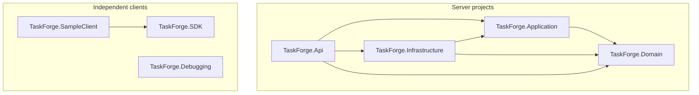
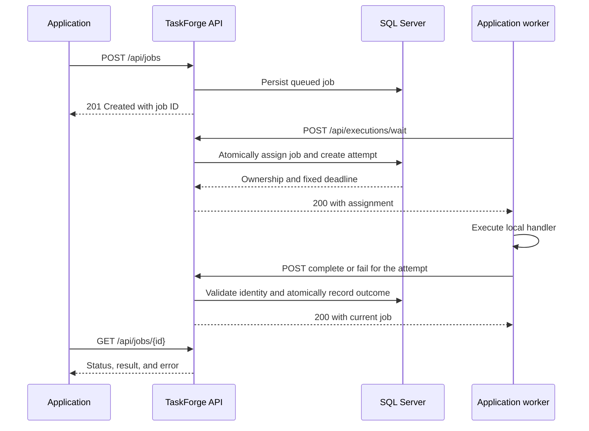
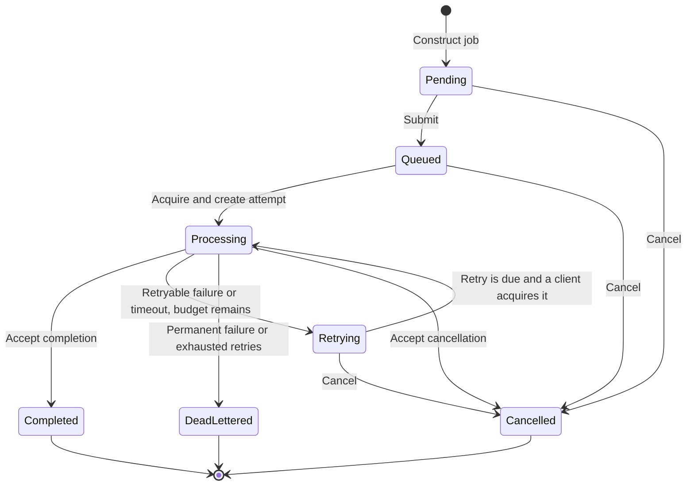

# Architecture

[README](../README.md) · [HTTP API](http-api.md) · [.NET client](dotnet-client.md)

TaskForge separates durable orchestration from application execution. The server
owns job state, assignment, retries, and recovery. Clients own business handlers,
payload validation, and external effects. SQL Server is the source of truth for
ownership and attempt history.

## Projects and dependencies

Arrows below are direct project references, not HTTP calls. Third-party packages
and test projects are omitted.



| Project | Responsibility |
| --- | --- |
| `TaskForge.Api` | HTTP contracts, dependency registration, startup, and OpenAPI. |
| `TaskForge.Application` | Submission, distribution, reporting, cancellation, retry policy, and maintenance. |
| `TaskForge.Domain` | Job and attempt state transitions. |
| `TaskForge.Infrastructure` | EF Core mappings, SQL transactions, concurrency checks, and schema initialization. |
| `TaskForge.SDK` | Independent HTTP client, local handler registry, and optional hosted worker. |
| `TaskForge.SampleClient` | Report and HTTP handlers, plus application-owned submission commands. |
| `TaskForge.Debugging` | Read-only HTTP console with no project references. |

The API hosts `JobMaintenanceService`, which expires deadlines and recovers leases.
It has no business-handler registry. The Docker runtime image contains the API
publish output, excluding the SDK and sample client. Database initialization runs
before the API begins serving requests.

## Request and execution flow

The submitting application and worker may be in the same process or separate
services. All client communication is initiated toward TaskForge.



When no compatible work is available, a wait returns `204` after its wait period.
The client can then make another wait request. TaskForge does not call a client
endpoint, distribute executable code, or require lease-renewal messages.

## Job lifecycle



Submission queues the job before persistence, so a new HTTP submission normally
returns `Queued`, not `Pending`. Acquisition of a due retry queues and starts it
within one transaction; there is no separate retry scheduler that moves all due
jobs into the queue.

`POST /api/jobs/{id}/retry` replays a `DeadLettered` or `Cancelled` job by creating
a **new job ID**. The original job and its attempts remain unchanged. This is
different from automatic retries, which retain the job ID and create new attempts.

Jobs and attempts have separate statuses. Attempts record `Running`, `Succeeded`,
`Failed`, `PermanentlyFailed`, `TimedOut`, `Cancelled`, or `Abandoned`. There is no
`Failed` job status: terminal job failure is `DeadLettered`.

## Ownership, deadlines, and retries

- **Routing:** application IDs are trimmed and lowercased. Job types match without
  case sensitivity. Clients advertise the types they can execute.
- **Acquisition:** compatible queued jobs and due retries are ordered by priority,
  then eligibility time, creation time, and ID. SQL locks, a concurrency token,
  and a transaction protect assignment and attempt creation.
- **Identity:** a report must identify the application, job, attempt, and exact
  worker. An old assignment cannot overwrite a newer attempt.
- **Time:** execution starts at acquisition. SQL Server time determines the fixed
  deadline and acceptance of reports. Lease grace supports recovery; it does not
  extend the execution deadline. Keep client clocks synchronized.
- **Retry policy:** retryable failures and timeouts increment `retryCount`. With
  `maxRetries: 3`, a job can have an initial attempt and three automatic retries.
  Default delays are 5, 10, and 20 seconds, with exponential backoff capped at 300
  seconds. Permanent failure codes bypass retries.
- **Cancellation:** an accepted request persists cancellation and closes the active
  attempt. It cannot prove that remote code has stopped. A request racing with a
  completed job or exhausted timeout can return `409`.

Server maintenance continues without clients. It reconciles expired executions
and abandoned leases; compatible clients acquire any resulting retries when due.
A worker that ignores its cancellation token may keep running after the server
has rejected its ownership, potentially overlapping a replacement attempt.

## Delivery and business idempotency

There are three distinct concerns:

| Concern | Mechanism |
| --- | --- |
| Repeated submission | `Idempotency-Key`, scoped to an application and the same submission content. |
| Lost outcome acknowledgment | Repeat the same Complete/Fail request for the same assignment; identical accepted reports return success. |
| Repeated external effects | Application-owned durable deduplication or an idempotent receiving service. |

The SDK retries uncertain outcome delivery without invoking the handler again for
that assignment. Pending reports live in memory. If the process exits before an
outcome is accepted, server timeout recovery can produce another attempt.

Use a stable business operation key, or the application ID and job ID, to deduplicate
effects across automatic retries. An attempt ID changes on retry. A manual replay
also changes the job ID, so deduplication across replays needs a business key.
Neither submission idempotency nor duplicate reporting makes external effects
exactly once.

## Server configuration

[compose.yaml](../compose.yaml) starts SQL Server and the API, publishing the API
at port `8275`. SQL Server has no published host port. The API waits for SQL Server
health and applies its schema automatically. The SQL named volume persists across
`docker compose down`.

For direct setup, copy [.env.example](../.env.example) to `.env`, replace its
placeholder with a strong SQL Server password, and run from the repository root:

```sh
docker compose up --build -d --wait --wait-timeout 180
```

Check [readiness](http://localhost:8275/api/ready) for `{"status":"Ready"}` before
sending requests. Compose waits for SQL health but has no API readiness health
check. The PowerShell setup script performs that extra readiness check.

Keep an existing volume's database password when reusing it. Editing `.env` does
not change the password stored in SQL Server. Avoid posting resolved Compose
configuration or credentials in issues.

Outside Compose, the API requires `ConnectionStrings__TaskForge`. Retry and
maintenance settings are in [appsettings.json](../src/TaskForge.Api/appsettings.json):

| Setting | Default | Purpose |
| --- | --- | --- |
| `Worker__PollIntervalMilliseconds` | `500` | Server maintenance interval. |
| `Worker__RetryDelaySeconds` | `5` | Initial automatic retry delay. |
| `Worker__MaxRetryDelaySeconds` | `300` | Retry delay cap. |
| `Worker__LeaseGraceSeconds` | `30` | Recovery grace after the execution deadline. |

These are API environment variable names. Add overrides to the API service's
`environment` section when using Compose; an arbitrary entry in `.env` is not
automatically passed into the container. Worker concurrency is configured in
each external client, independently of these server settings.

## Diagnostics

```sh
docker compose ps
docker compose logs --tail 100 api sqlserver
```

`GET /api/health` checks that the API responds; `GET /api/ready` checks database
connectivity. `GET /api/stats` summarizes current job states across all
applications, not historical attempts. For a specific job, inspect both its
current record and [attempt history](http-api.md#inspect-cancel-and-replay).

If a job stays queued, check that a worker is running with the same application ID
and a matching type. For a failed attempt, inspect its error and deadline before
replaying it. Historical worker tables remain in the schema but do not control
execution capacity.
